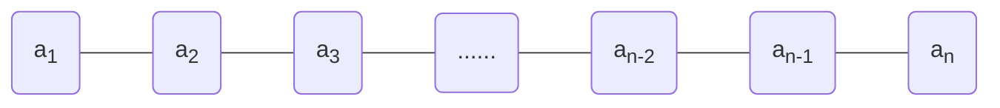

# 线性解构

## 什么是数据结构

- 数据结构是计算机存储、组织数据的方式

- 线性解构

  - 数组，链表，栈，队列，哈希表

  ```mermaid
  graph LR
  num1((1))---num2((2))---num3((3))---num4((4))---num5((5))---num6((6))---num7((7))---num8((8))---num9((9))
  ```

- 树形解构

  - 二叉树，AVL 树，红黑树，B 树，堆，Trie，哈夫曼树，并查集

  ```mermaid
  graph TD
  a((A))---b((B))
  a---c((C))
  a---d((D))
  b---e((E))
  b---f((F))
  b---g((G))
  c---h((H))
  d---i((I))
  d---j((J))
  ```

- 图形结构

  - 邻接矩阵，邻接表

  ```mermaid
  graph TD
  1((1))---2((2))
  1---3((3))
  2---4((4))
  2---8((8))
  2---5((5))
  3---5
  3---6((6))
  4---9((9))
  4---8
  8---9
  5---9
  5---7((7))
  7---9
  7---6
  9---6
  ```

- 在实际应用中，根据使用场景来选择最合适的数据结构

## 线性表

- <font color="blue">**线性表**</font>是具有 n 个<font color="orange">**相同类型元素**</font>的<font color="pink">**有限**</font><font color="red">**序列**</font>（ n ≥ 0 ）



- a1 是首节点（首元素）， an 是尾结点（尾元素）
- a1 是 a2 的前驱， a2 是 a1 的后继

## 数组

- 数组是一种<font color="red">**顺序存储**</font>的线性表，所有元素的<font color="red">**内存地址是连续的**</font>
   ```java
    // array 作为变量存储在栈空间
    // new 的作用是向堆申请空间
    int [] array = new int[]{1, 2, 3} 
   ```

- 数组存在的问题： 在很多编程语言中，数组都有个致命的缺点 无法动态修改容量

- 所以需要自己创建动态数组

### 动态数组接口

> JAVA 中成员变量会自动初始化，比如 int 类型自动初始化为0， 对象类型自动初始化为 null

- int size(); // 元素的数量

- boolean isEmpty();

- boolean contain(E element);

- void add(E element);

- E get(int index);

- E set(int index, E element);

- void add(int index, E element);

- E remove(int index);

- int indexOf(E element);

- void clear();


