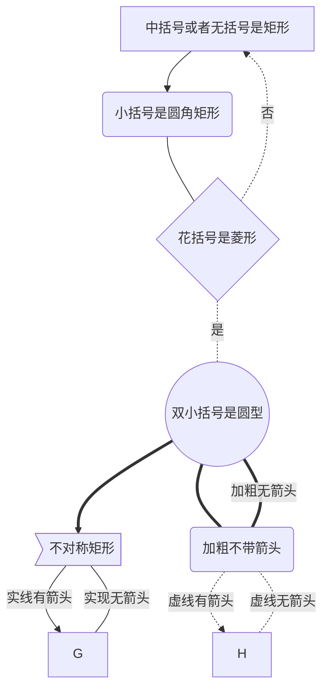
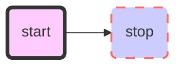
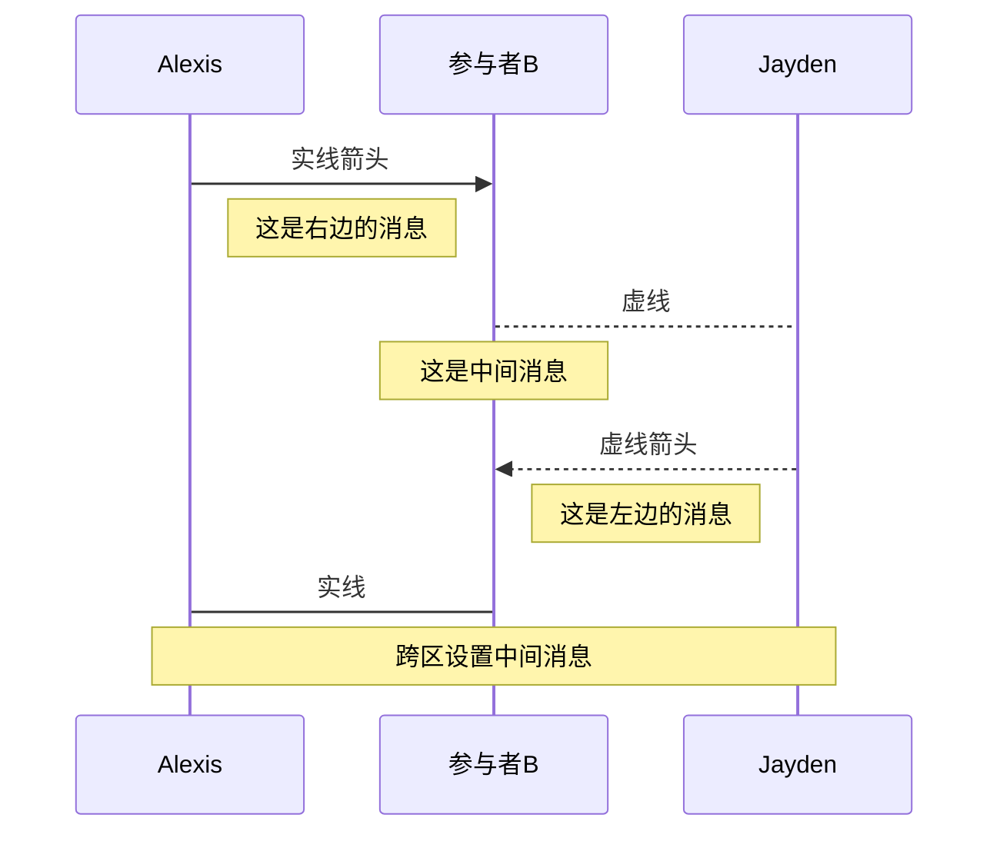
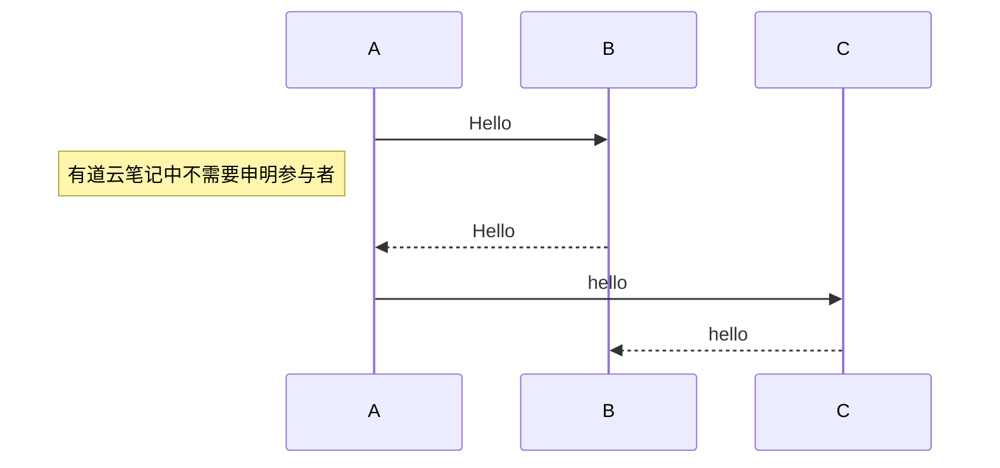
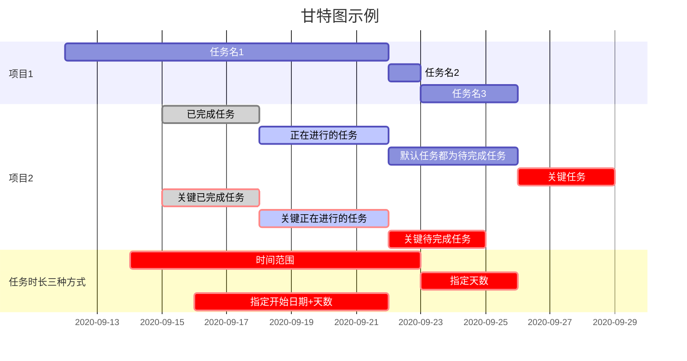
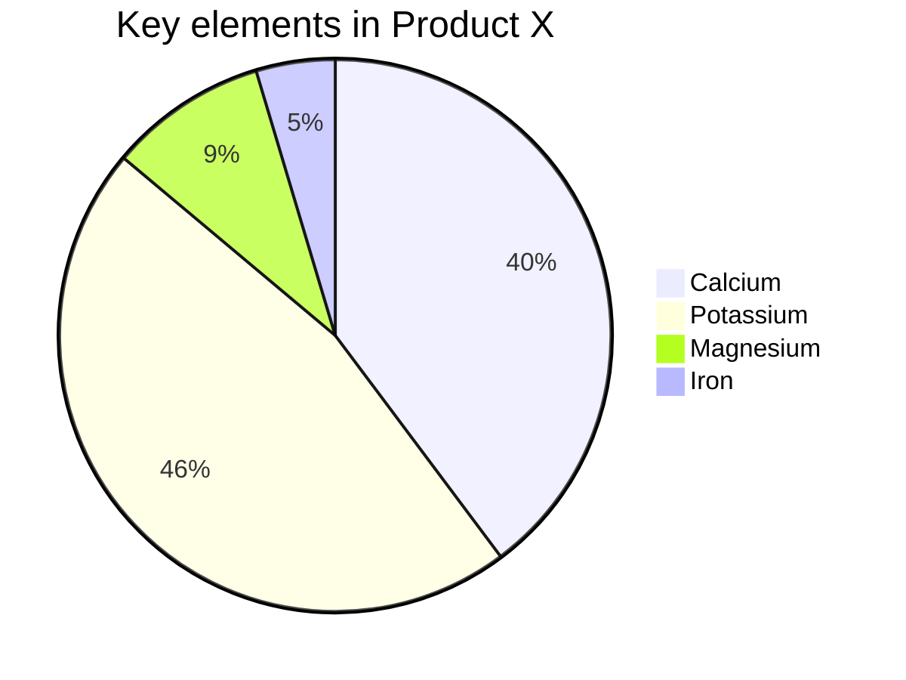

# 标题 1

## 标题 2

### 标题 3

#### 标题 4

##### 标题 5

###### 标题 6

---

## 字体

**加粗**

_斜体_

**_粗斜体_**

~~删除线~~

<u>下划线</u>

---

## 上下标

- 上标：\^ 上标\^ : 这是^上标^
- 下标：\~下标\~：这是~下标~
- <sup> -> 这是<sup>上标</sup>
- <sub> -> 这是<sub>下标</sub>
- 公式块 -> $下标：\theta_1 上标: \theta^2$


---

## 引用

> 这是引用

## 分割线

---

---

## 图片


## 超链接

[链接名](https://fishc.com.cn/)

## 列表

1. 有序
2. 有序
3. 有序

- 无序
- 无序

* 无序
* 无序

## TODO 列表

- [ ] 未处理事项 1

- [ ] 未处理事项 2

- [x] 已处理事项 1

- [x] 已处理事项 2

- [x] 已处理事项 3

## 表格

| 表头 | 表头 | 表头 |
| :--- | :--: | ---: |
| 内容 | 内容 | 内容 |
| 内容 | 内容 | 内容 |

## 代码

```javascript
console.log('这是代码块');
```

## 流程图

### 流程图方向

- TB 从上到下
- BT 从下到上
- LR 从左到右
- RL 从右到左

### 节点之间的连接

- A --> B A 带箭头指向 B
- A --- B A 不带箭头指向 B
- A -.- B A 用虚线指向 B
- A -.-> B A 用带箭头的虚线指向 B
- A ==> B A 用加粗的箭头指向 B
- A -- 描述 --- B A 不带箭头指向 B 并在中间加上文字描述
- A -- 描述 --> B A 带箭头指向 B 并在中间加上文字描述
- A -. 描述 .-> B A 用带箭头的虚线指向 B 并在中间加上文字描述
- A == 描述 ==> B A 用加粗的箭头指向 B 并在中间加上文字描述

### 示例 A



### 示例 B:自定义样式

**样式写法跟矢量图（SVG）中 CSS 的写法一致，格式如下：**

```
style 节点 样式
```



## 顺序图





## 甘特图



## pi



## flow

```flow

st=>start: 开始框

op=>operation: 处理框

cond=>condition: 判断框(是或否?)

sub1=>subroutine: 子流程

io=>inputoutput: 输入输出框

e=>end: 结束框

st->op->cond

cond(yes)->io->e

cond(no)->sub1(right)->op

```

**再 Typora 上使用需要写明 mermaid 关键字，具体代码如下**

---

## 自动链接

<https://www.baidu.com>

---

## 段落缩进

- 半方大的空白&ensp;或&#8194;看，飞碟
- 全方大的空白&emsp;或&#8195;看，飞碟
- 不断行的空白格&nbsp;或&#160;看，飞碟
- &emsp;&emsp;段落从此开始。

---

## 字体，字号，颜色

- $\color{orange}{字体颜色}$

- <font face="黑体">我是黑体字</font>
- <font face="微软雅黑">我是微软雅黑</font>
- <font face="STCAIYUN">我是华文彩云</font>
- <font color=#0099ff size=12 face="黑体">黑体</font>
- <font color=#00ffff size=3>null</font>
- <font color=gray size=5>gray</font>
- <em>我时 HTML 格式的文字</em>

---

## MarkDown 使用 HTML 的 style 属性

**markdown 不支持<style></style>只能再标签中嵌套使用样式**

### 文字使用样式

<div style="color:blue; font-size:30px; background-color:green">使用div来撑开一行</div>

我要放大<span style="color:red; font-size:20; background:yellow">代码</span>这两个字,用红色表示，黄色做底色

### 表格使用样式

<table style="width:500px; text-align:center">
<tr style="color:#ff00ff">
<th>head</th>
<th>head</th>
<th>head</th>
</tr>
<tr style="color:00ffff">
<td>text</td>
<td>text</td>
<td>text</td>
</tr>
</tr>
<tr>
<td>text</td>
<td>text</td>
<td>text</td>
</tr>
</tr>
<tr>
<td>text</td>
<td>text</td>
<td>text</td>
</tr>
</table>

|      | head | head |
| ---- | ---- | ---- |
| text | text | text |
| text | text | text |
| text | text | text |

---

## 公式

### 1. 公式展示

- 行内公式： \$...\$
- 整行公式： \$\$..... \$\$

### 2. 上下标

- \^ 表示上标，\_ 表示下标，如果上下标的内容多于一个字符，需要用 `{}` 将这些内容括成一个整体。上下标可以嵌套，也可以同时使用。举例:

  $x^{y^z}=(1 + e^x)^{-2xy^w}$

  <font size=6 color="red">$x^{y^z} = (1 + e^x)^{-2xy^w}$</font>

- {\\rm e} 矫正 e 字母

  <font size=6 color="green">$x^{y^z} = (1 + {\rm e}^x)^{-2xy^w} $</font>

- 上下标同时存在

  <font size=6 color="purple">$C_n^2$</font>

### 3. 分式

`\frac{}{}` 表示分式，第一个花括号内容为分子，第二个花括号内容为分母

<font size=6 color="orange">$f(x,y)=\frac{x + y}{3x^2 + 4y^{2.5}}$</font>

### 4. 根号

\sqrt{}表示开根号，\sqrt[]{}中括号表示开几次方，后面花括号为开方内容

<font size=6 color="orange">$f(x,y)=\frac{\sqrt[3]{x^2+y^2}}{\sqrt{3x^2 + 4y^{2.5}}}$</font>

### 5. 累加与累乘

使用 \sum 来输入一个累加。与之类似，使用 \prod `来输入累乘。

<font size=6 color="red">$\sum\limits_{i=1}^nf(x_i)$</font>

<font size=6 color="red">$\prod\limits_{i=1}^n(x_i - 1)(x_i + 2)$</font>

### 6. 积分

使用 \int 来输入一个积分。

<font size=6 color="red">$\int_0^1 x^2{\rm d}x$</font>

### 7. 极限运算

使用 \lim 来输入一个极限。\to 表示从箭头 ，\infty 表示无穷大，\limits\_ 表示置于正下方。

<font size=6 color="orange">$\lim\limits_{n \to \infty}\frac{1}{n(n+1)}$</font>

### 8. 括号

()、[] 和 | 表示符号本身，使用 \{\} 来表示 {} 。当要显示大号的括号时，要用 \left 和 \right 命令

<font size=6 color="orange">$f(x,y,z)=2y^3z \left(7 + \frac{5x + 8}{4 + y^3} \right)$</font>

<font size=6 color="orange">$\frac{du}{dx}|_{x=0}$</font>

### 9. 省略号

数学公式中常见的省略号有两种，\ldots 表示与文本底线对齐的省略号，\cdots 表示与文本中线对齐的省略号。

<font size=6 color="orange">$f(x_1,x_2,\cdots,x_n)=x_1^2+x_2^2+\cdots+x_n^2$</font>

<font size=6 color="purple">$f(x_1,x_2,\ldots,x_n)=x_1^2+x_2^2+\ldots+x_n^2$</font>

### 10. 矢量

使用 \vec{矢量} 来自动产生一个矢量。也可以使用 \overrightarrow 等自定义字母上方的符号。\cdot 表示一个点，在公式中往往表示向量乘法。

<font size=6 color="red">$\vec{a}\cdot\vec{b} $</font>

左箭头，两边箭头，右箭头示例，其中\quad 表示四个空格：

<font size=6 color=87CEEB>$\overleftarrow{xy} \quad \overleftrightarrow{xy} \quad \overrightarrow{xy}$</font>

### 11. 常用希腊字母

|    大写    |  markdown   |    小写    |  markdown   |
| :--------: | :---------: | :--------: | :---------: |
|  $\Alpha$  |  \$\Alpha$  |  $\alpha$  |  \$\alpha$  |
|  $\Delta$  |  \$\Delta$  |  $\delta$  |  \$\delta$  |
| $\Lambda$  | \$\Lambda$  | $\lambda$  | \$\lambda$  |
|  $\Delta$  |  \$\Delta$  |  $\delta$  |  \$\delta$  |
|   $\Eta$   |   \$\Eta$   |   $\eta$   |   \$\eta$   |
| $\Epsilon$ | \$\Epsilon$ | $\epsilon$ | \$\epsilon$ |
|  $\Theta$  |  \$\Theta$  |  $\theta$  |  \$\theta$  |
|  $\Beta$   |  \$\Beta$   |  $\beta$   |  \$\beta$   |
|   $\Pi$    |   \$\Pi$    |   $\pi$    |   \$\pi$    |
|   $\Phi$   |   \$\Phi$   |   $\phi$   |   \$\phi$   |
|   $\Psi$   |   \$\Psi$   |   $\psi$   |   \$\psi$   |
|  $\Omega$  |  \$\Omega$  |  $\omega$  |  \$\omega$  |

### 12. 方程组

- 表达式一：需要 cases 环境，起始、结束处以{cases}声明
  
  > \\\\ 表示换行， \\\\\\\\ 表示两个换行

<font size=6 color="#20B2AA"> $\begin{cases} a_1x + b_1y + c_1z = d_1\\ a_2x +b_2y + c_2z = d_2\\ a_3x + b_3y + c_3z = d_3 \end{cases}$ </font>

- 表达方式二: 使用\begin{array}\\ 表达式一\\表达式二... \end{array}

> 左边\left 表示显示大的花括号，右边\right.表示不显示右边，\left 和\right 必须成对出现

<font size=6 color="orange">$\left\{ \begin{array}\\ a_1x + b_1y + c_1z = d_1\\ a_2x + b_2y + c_2z = d_2\\ a_3x + b_3y + c_3z = d_3\  \end{array} \right.$</font>

- 表达式三：需要 align 环境，起始、结束处以{align}声明，align 表示对齐（也可以使用 aligned，公式中的&表示对齐）

<font size=6 color="orange">$f(x,y,z) = \left \{ \begin{aligned} &3x + 5y + z \quad &, x<0 \\ &7x - 2y + 4z \quad &, x>0 \\ &-6x + 3y + 2z \quad &, x=0 \end{aligned} \right.$</font>

### 13. 复杂公式的推导

<font size=6 color="red">$ l(\theta)=\sum\limits_{i=1}^n log p (y^{(i)}|x^{(i)};\theta) $</font>

<font size=6 color="red">$ \quad \quad = \sum\limits_{i=1}^n log \prod\limits_{j=1}^k \phi_j^{I\{y^{(i)}=j\}} $</font>

<font size=6 color="red">$ \quad \quad = \sum\limits_{i=1}^n log \prod\limits_{j=1}^k (\frac{e^{\theta_j^T x^{(i)}}}{\sum\limits_{l=1}^k e^{\theta_l^T x^{(i)}}})^{I\{ y^{(i)}=j\}} $</font>

### 14. 矩阵

- 使用 \begin{matrix} ... \end{matrix} 生成，每一行以 \\ 结尾表示换行，各元素间以 & 隔开，右边的序号用 \tag{n} 表示.
  <font size=6 color="orange">$ \begin{matrix} 1 & 2 & 3 \\ 4 & 5 & 6 \\ 7 & 8 & 9 \end{matrix} $</font>

- 带大括号
  <font size=6 color="orange">$ \left\{ \begin{matrix} 1 & 2 & 3 \\ 4 & 5 & 6 \\ 7 & 8 & 9 \end{matrix} \right\} $</font>

- 带中括号
  <font size=6 color="orange">$ \left[\begin{matrix} 1 & 2 & 3 \\ 4 & 5 & 6 \\ 7 & 8 & 9 \end{matrix}\right] $</font>

- 包含省略号，矩阵：（行省略号\cdots，列省略号\vdots，斜向省略号（左上至右下）\ddots）
  <font size=6 color="orange">$ \left\{ \begin{matrix} 1 & 2 & \cdots & 5 \\ 6 & 7 & \cdots & 10 \\ \vdots & \vdots & \ddots & \vdots \\ \alpha & \alpha_1 & \ldots & \alpha+4 \end{matrix} \right\} $</font>

### 15. 常用符号

|       preview       |   markdown    |  备注  |
| :-----------------: | :-----------: | :----: |
|      $\times$       |   \$\times$   |        |
|       $\div$        |    \$\div$    |        |
|        $\pm$        |    \$\pm$     |        |
|        $\ge$        |    \$\ge$     |        |
|        $\le$        |    \$\le$     |        |
|      $\infty$       |   \$\infty$   |        |
|      $-\infty$      |  \$-\infty$   |        |
|      $\hat{y}$      |  \$\hat{y}$   |        |
|       $\not=$       |   \$\not=$    |        |
|       $\neq$        |    \$\neq$    |        |
|      $\approx$      |  \$\approx$   |        |
|     $\because$      |  \$\because$  |        |
|    $\therefore$     | \$\therefore$ |        |
| $a \space \space b$ |   \$\space$   |  空格  |
|     $a \quad b$     |   \$\quad$    | 大空格 |

***

### markdown相关设置

#### Typora 如何正确使用上下标

- 文件 -> 偏好设置 -> 点击 Markdown -> Markdown 扩展语法 -> 复选下标 和 上标
- 就可以使用 ^^ 和 ~~ 来表示上下标

***


### 练习

<font size=6 color="red">$ l(\theta) = \sum\limits_{i=1}^2 log p (y^{(i)} | x^{(i)};\theta) $</font>

<font size=6 color="red">$ \quad \quad = \sum\limits_{i=1}^n log \prod\limits_{j=1}^k \phi_j^{I\{y^{(i)}=j\}} $</font>

<font size=6 color="red">$ \quad \quad \sum\limits_{i=1}^n log \prod\limits_{j=1}^k (\frac{e^{\theta_j^T x^{(i)}}}{\sum\limits_{l=1}^k e^{\theta_l^T x^{(i)}}}) I\{ y^{(i)}=j \}  $</font>


<font size=6 color="red">$f(x,y,z) = \left\{ \begin{aligned} &3x+5y+z \quad &, x<0 \\ &7x-2y+4z \quad &, x>0 \\ &-6x+3y+2z \quad &, x=0 \end{aligned} \right.$</font>

<font size=6 color="red">$\left\{ \begin{matrix} 1 & 2 & \cdots & 5 \\ 6 & 7 & \cdots & 10 \\ \vdots & \vdots & \ddots & \vdots \\ \alpha & \alpha_1 & \cdots & \alpha+4 \end{matrix} \right\}$</font>
