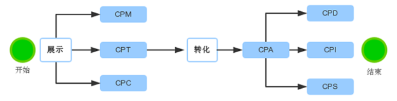
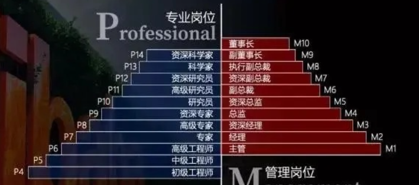

# other

## 术语
- Martech:
- ADtech:
### 广告行业中常说的 CPC，CPM，CPD，CPT，CPA，CPS 等词的意思是什么?

> 广告投放流程主要分为展示和转化，CPC/CPM/CPD/CPT/CPA/CPS等代表的是不同的结算模式

- 展示端的结算方式有：

1. *CPM(Cost Per Mille) 每千人成本*：只要向足够量级的用户展示了广告主的内容，广告主就为此付费。按此计费的广告一般是以品牌展示和产品发布为主，如新闻客户端的GD广告，曝光效果通常比较好。

2. *CPT(Cost Per Time)每时间段成本*：以固定价格买断一段时间内的广告位展示，如开屏广告、富媒体广告或应用市场的下拉关键词等。

3. *CPC(Cost Per Click) 每点击成本*：根据广告被点击的次数收费。关键词竞价一般采用这种模式，在信息流广告系统中比较常见。

- 转化端的结算方式通常可以统称为CPA(Cost Per Action) 每行动成本，按投放实际效果计价的广告，这里的行动成本可以是：

1. *CPD(CostPer Download)每下载成本*：按用户完成APP下载计费，在应用商店、积分墙、流量联盟比较常见

2. *CPI(Cost Per Install)每安装成本*：按用户激活APP计费，渠道按这种模式结算比较少，通常只作为广告主内部衡量广告投放效果的指标之一

3. *CPS(Cost Per Sales)每销售成本*：按完成订单的用户数量结算，高质量垂直渠道、返利网站比较喜欢采用这种模式

### 阿里企业职阶

https://blog.csdn.net/weixin_44946117/article/details/90768441

