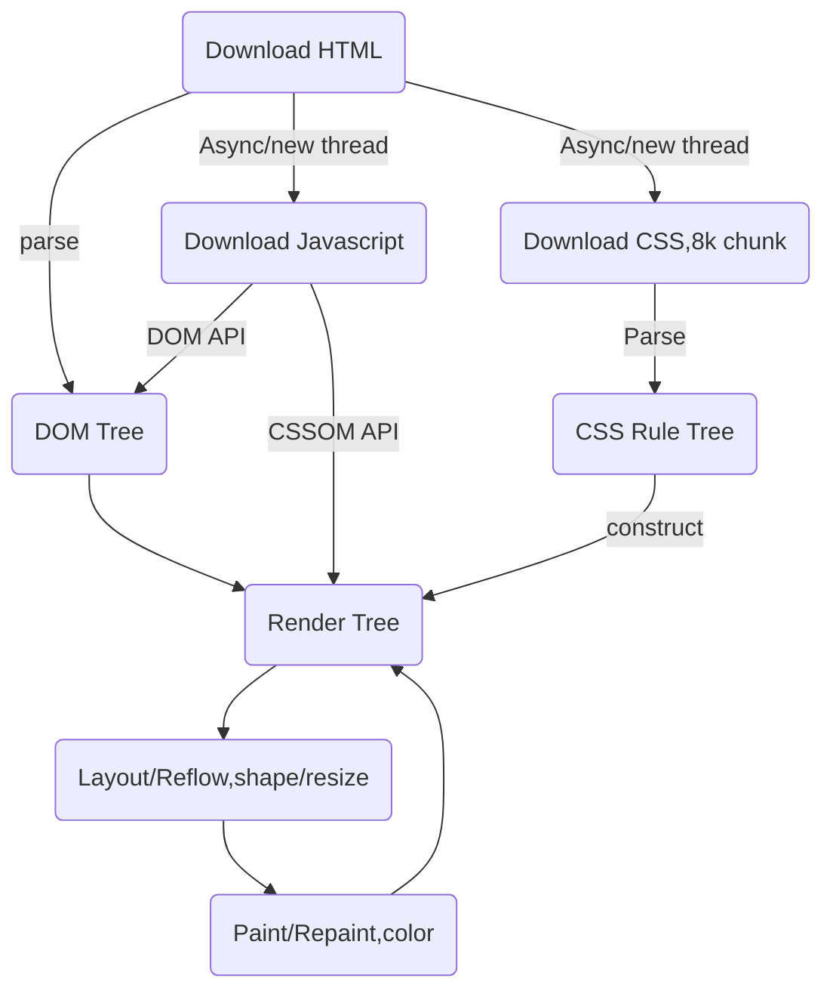

# css 基础

## 01 样式表

- 内联样式：行内样式 -> 实际开发中一般不适用 -> 实战中的唯一出现是用来传递数据 -> `
...data...
`

- 内部样式表：``

- 外部样式表：`<link rel="stylesheet" href="./css/index.css" />`

- 内联样式（行内样式） > 内部样式表 > 外部样式表

## 02 browser 加载html page的方法

