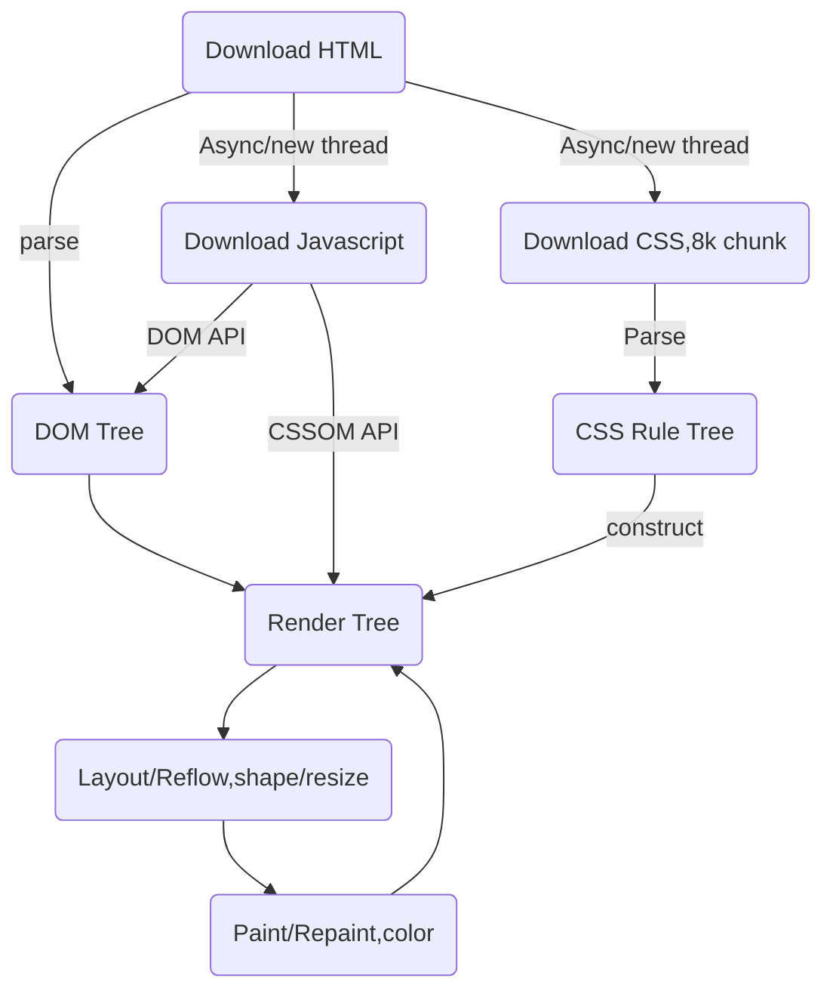

# css 基础

## 01 样式表

- 内联样式：行内样式 -> 实际开发中一般不适用 -> 实战中的唯一出现是用来传递数据 -> `<div style="display:none">...data...</div>`

- 内部样式表：`<style type="text/css">...</style>`

- 外部样式表：`<link rel="stylesheet" href="./css/index.css" />`

- 内联样式（行内样式） > 内部样式表 > 外部样式表


## 02 browser 加载html page的方法



## 03 选择器

### 基础选择器

- id

- class

- 标签

- '*'选择器

- 属性选择器： [id="box"],[href] -> 再表单中使用的多

### 应用优先权

- !important -> 慎用，如果使用说明逻辑有问题


### 选择器优先级

- !important > id > class = 属性 > 标签 > *

### 派生选择器

- 父子选择器： father son -> father and son 可为任一选择器类型(id, class, 属性, 标签) -> #father #son 不行 -> id是唯一的，不需要派生

- 浏览器对父子选择器的匹配规则： 从下到上匹配 -> 因为父亲永远只有一个

- 越级：即使不是父子关系，祖孙关系也一样可以越级生效
```html
<style type="text/css">
      .box span {
        color: pink;
      }
    </style>
  </head>
  <body>
    <div class="box" >
      <h1>
        <span>Yui Nikaido</span>
      </h1>
    </div>
  </body>
```

### 并列选择器

1.  h1.title -> 标签.类名 -> 便于区分

2. .box.box1 -> .classname.sonclassname

3. 练习 

- 文本提示样式类
```css
    <style type="text/css">
      .tip {
        font-weight: bold;
      }

      .tip.tip-success {
        color: green;
      }

      .tip.tip-warning {
        color: orange;
      }

      .tip.tip-danger {
        color: red;
      }
    </style>
  </head>
  <body>
   <p class="tip tip-success">sucess = green</p> 
   <p class="tip tip-warning">warning = orange</p>
   <p class="tip tip-danger">danger = red</p>

  </body>
```

### 分组选择器

- h1,p,.box: 分组选择器通过","分割


### 相邻兄弟选择器

- el1 + el2 -> .checkbox input[type="checkbox"]:checked + lable
  1. 同父
  2. 相邻
  3. 在其之后


### CSS权重

> 数学：正无穷 = 正无穷 + 1
> 计算机： 正无穷 < 正无穷 + 1

|类型|权重|
|:---:|:---:|
|*|0|
|标签，伪元素|1|
|class,属性,伪类|10|
|id|100|
|内联样式|1000|
|!important|正无穷|

- 实际权重不是10,100，而是256级别的

- 练习
```html
    <style type="text/css">
      #div-id .h1-class{
        color: green;
      }

      .div-class .h1-class{
        color: red;
      }

      .div-class #h1-id.h1-class{
        /* 生效 */
        color: palegreen;
      }
    </style>
  </head>
  <body>
    <div id="div-id" class="div-class">
      <h1 id="h1-id" class="h1-class"> Yui Nikaido</h1>
    </div>
  </body>
```


## css 属性样式

### css参考手册

- css.doyoe.com

### outline(轮廓)

- outline-color: green

- outline-style: dotted;

- outline-width: 30px;

- outline:none; -> 去掉轮廓

### button

- border:none;

- background-color: green;

- color: white;

- font-size: 14px;

### 宽高，高度

> 在浏览器中，inline & inline-block 中空格和换行都被视为文本分隔符

- width

- height

- min-width: 设置后不会产生折行，造成样式被破坏

- max-width：设置后不会宽度不会超过该值

- min-height： 最小高度，内容超不超过都有这个高度

- max-height： 最大高度，盒子最大只能有这个高度

### 溢出管理 overflow

- overflow: hidden;

- overflow: scroll; -> 滚动条一般17px，占用盒子内部宽度

- overflow: auto;

### font

> 浏览器默认的字体大小是16px->pixel

- font-size: 浏览器设置字体时设置的是高度，宽度自动缩放 -> 开发中常用的字体大小：12,14,16,18(偶尔)

- font-weight: 字体粗细 -> lighter/normal/bold/bolder/100-900 -> 不是所有字体都有lighter/bolder/数值等粗细样式
```html
// 标签自带样式时，浏览器自动为标签添加了样式 strong {font-weight:bold}
// f12可查看
<strong>hello Yui Nikaido</storng>
```

- font-style: 字体风格 -》 italic/oblique(斜体/倾斜)(两个效果一样，为什么有两个，因为所有字体中不是所有字体都有italic风格，如果没有就用oblique来强制倾斜)

- font-family: 
   - 通用字体：arial -> widows, linux, Mac 都安装了该字体
   - 可写复合字体：“Times new Roman",Georgia,serif; -> 回退，第一种字体不兼容就用第二种字体，一次类推 -> 名字有空格的字体，中文字体需要加双引号，其他可以不加
   - 兼容性比较好的字体："Hiragino Sans GB","Microsoft Yahei",arial,\5b8b\4f53(宋体),"Helvetica Neue",Helvetica,STHeiTi,sans-serif;

- color: 字体颜色
   - 英文单词颜色名: 在项目当中不使用
   - 16进制颜色值: # red(00-ff) green(00-ff) blue(00-ff)
   - 16进制颜色值: # red(0-255) green(0-255) blue(0-255) -> rgb(255,0,0) -> rgb(100%, 0%, 0%) -> rgb(260, 0, 0)结果还是红色，只认到255


### border

- border: 1px solid #000; 默认变宽是占盒子以外的宽高

- border-top/right/left/bottom: 变宽可单独设置

- border-width: 
   - border-width: 5px 10px 上下，左右
   - border-width: 5px 2px 10px 上，左右，下
   - border-width: 5px 2px 10px 7px 上右下左

- border-style： dotted/dashed/solid/double/groove/ridge/inset/outset

- border-color: border-top-color, border-right-color, border-bottom-color, border-left-color

- border实现三角形：
```css
/* 方法1 */
.test {
        width: 0;
        height:0;
        border-width:100px;
        border-style: solid;
        border-top-color: transparent;
        border-right-color: transparent;
        border-bottom-color: transparent;
        border-left-color: orange;
      }

/*方法2 常用*/
.test {
        width: 0;
        height:0;
        border: 100px solid transparent;
        border-right-color: orange;
      }
```

### 文本text

- textalign(水平对齐): right/center/left -> 容器必须具有宽高

- line-height(文本行高)：一行所占据的高度，字体为16时默认行高为22，上下3

- 垂直居中： line-height: height

- text-indent(文本缩进)：多用于input标签，或者文本缩进；
```css
p {
    /*每段开头空两个字符*/
    text-indent: 2em; 
}
```

- text-decoration(文本线)： underline/line-through/overline/none;

- cursor(光标): pointer(手势)/not-allowed(禁止)/help(问号)/resize

### 单行文本截断和显示省略号
```css
.test {
  white-space: nowrap; /*不换行*/
  overflow:hidden; 
  text-overflow: ellipsis; /*隐藏溢出部分并加省略号*/
}
```

### 多行文本截断和显示省略号

- 方法1： 截取文本，加省略号；

- 方法2： 根据行高计算盒子高度，设置溢出隐藏，手动增加省略号(伪元素)覆盖行末文字。

### display

- display: none/inline/inline-block/block/table/table-cell

### 伪类

- hover: 移入元素

- disabled: button:disabled
```css
button:disabled {
  background-color: #333;
  color: #fff;
}
```

- checked: 美化原生checkbox
```html
<style type="text/css">
      .checkbox {
        width: 40px;
        height: 40px;
        border: 2px solid #333;
        border-radius: 50%;
      }

      .checkbox input {
        display: none;
      }

      .checkbox label {
        display: block;
        width: 20px;
        height: 20px;
        border-radius: 50%;
        background-color: #333;
        margin: 10px;
        opacity: 0;
        filter: alpha(opacity=0); /*兼容性 这里的opacity值为0-100*/
      }

      .checkbox input[type="checkbox"]:checked + label {
        opacity: 1;
        filter: alpha(opacity(100));
      }
    </style>
  </head>
  <body>
    <div class="checkbox">
      <input type="checkbox" id="checkbox">
      <label for="checkbox"></label>
    </div>
  </body>
```

- input:focus
```css
ipnut {
  outline: none
}

input:focus{
  border: 1px solid blue
}
```

- :first-child

- :last-child

- :nth-child() -> :ntch-child(odd)(奇数)/:nth-child(even)(偶数)/nth-child(num)


### vertical-align

- 解决行内元素与行内块元素文本对齐的问题：行内块元素无文字默认底部对齐，行内块元素有文字默认与行内块的初始化时的文字对齐

- vertical-align: bottom/top/middle/-30px/30px

- vertical-align 写在两个元素中任何一个都可以

### 容器内多行文本居中的方法

1. 将容器的display设置成table

2. 将容器内文本的display设置成table-cell(表格单元格属性)

3. 将容器内的文本的vertical-align 设置成middle

```css
 .test {
      display: table;
      width: 100px;
      height: 100px;
      border: 1px solid #333;
    }

    .test span {
      display: table-cell;
      vertical-align: middle;
    }
  </style>
</head>
<body>
  <div class="test">
    <span>Yui Nikaido Yui Nikaido </span>
  </div>
```

### 去除行内或行内块元素文本间隔符的方法

- 去掉换行或空格，变成连写


### display:none 和 visibility:hidden 的区别

- display:none -> 不保留元素空间

- visibility: hidden -> 隐藏后保留元素空间


### 重写有样式的标签的样式
```css
h1 {
  font-weight: normal;
}

a {
  text-decoration: none;
}
```


### 绝对单位和相对单位
- 绝对单位：不会因为环境的变化而造成变化 -> pixel
- 相对单位：根据环境变化而变化 -> em, rem
- 浏览器默认字体大小是16px, 要设置为10px, 就需要在初始化是将字体设为62.5%这样，1em就等于10px, 默认1em = 16px

```css
body,html {
  font-size:62.5%
}
```

- 练习：行高等于1.2倍字体大小如何设置 
```css
.test {
  line-height: 1.2em;
}
```

- 举例
```html
<style type="text/css">
      .test {
        width: 100%;
        min-width: 400px;
        max-width: 700px;
        height: 60px;
        font-size: 20px;
        background-color: orange;
      }
    </style>
  </head>
  <body>
    <div class="test">
      111111111111111111111111
      111111111111111111111111
    </div>
  </body>
```


## box model (盒子模型)

- 盒子 = 容器

- 宽高所划分的区域

- 边框: border

- 内边距：padding

- 外边距：margin

- 默认边框，内边距，外边距都不占用容器的宽高

- 默认盒子的可视区域 = 盒子的宽 + 2* 边框 + 2*内边距 -> 高度同理

- 子宽高为100%，父设置padding后，内层盒子居中外层盒子 -> 上下左右padding同宽

### 如何让边框和边距只占用盒子宽高，不外扩

- box-sizing: border-box 只兼容IE8 以上

- -moz-box-sizing: border-box 兼容firefox

- -webkit-box-sizing: border-box 兼容chrome safari (默认兼容)

- -ms-box-sizing: border-box 兼容IE8以下

- -o-box-sizing: border-box 兼容presto opera

- 开发中写要全部都写

- 开发中直接初始化
```css
div {
  box-sizing:border-box;
}
```

- 如何解开border-box: box-sizing:content-box;

- 企业开发中直接设置一个类来解开border-box
```css
.content-box {
  box-sizing: content-box;
  -moz-box-sizing: content-box;
  -webkit-box-sizing: content-box;
  -ms-box-sizing: content-box;
  -o-box-sizing: content-box;
}
```

### padding复合值

- padding:30px 20px 10px 5px; 上 右 下 左

- padding:30px 20px 10px; 上 左右 下

- padding: 30px 20px; 上下 左右

- padding: 30px;  上下左右

- padding-top, padding-right, padding-bottom, padding-top

### margin 复合值

- 同padding和border


### 案例

- 连个内联元素的margin
```html
<!-- margin总和=30px + 30px -->
<style type="text/css">
    .text1{
      margin-right:30px;
    }

    .text2{
      margin-left:30px;
    }
  </style>
</head>
<body>
  <span class="text1">123</span><span class="text2">235</span>
</body>
```

### 盒子对浏览器居中

- margin: auto

- margin: 30px auto  

- margin: 30px auto 20px

- 以上三种方法


## position 定位

### position的五个值

- static: HTML 元素的默认值，即没有定位，遵循正常的文档流对象。 静态定位的元素不会受到 top, bottom, left, right影响。

- relative: 相对定位元素的定位是相对其正常位置。

- absolute: 

- fixed: 元素的位置相对于浏览器窗口是固定位置。 即使窗口是滚动的它也不会移动

- sticky: 基于用户的滚动位置来定位。(不常用)

### absolute(绝对定位)

- position: absolute

- left/top/right/bottom: top基准线是上边，bottom基准是下边，left基准线是左边，right基准线是右边

- 参考父级中离自己最近的有定位的父级，如果没有则相对于整个html文档进行定位, position:relative 也是定位

### relative(相对定位)

- 原来层的位置不被腾出

- relative： 是对元素本身位置进行定位，所以只去得到left和top, right和bottom取不到

```html
  <style type="text/css">
    .box {
      width: 300px;
      height: 300px;
      margin: 10px auto;
      background-color: orange;
    }

    .son-box{
      position:relative;
      /* right: 20px; 无效
      bottom: 20px; 无效*/
      top: 20px;
      left: 20px;
      width:100px;
      height: 100px;
      background-color:pink;
    }
  </style>
</head>
<body>
  <div class="box">
    <div class="son-box"></div>
  </div> 
</body>
```

- relative: 用法1 -> 用于子元素绝对定位

- relative用法2 -> 被决定定位元素覆盖的元素添加relative后可覆盖绝对定位元素显示，原理是在未设置z-index前提下，后定位在前定位的上层
```html
  <style type="text/css">
    .box1 {
      position: absolute;
      width: 100px;
      height: 100px;
      background-color: pink;
    }

    .box2 {
      position: relative;
      width: 100px;
      height: 100px;
      background-color: orange;
    }
  </style>
</head>
<body>
  <div class="box1"></div>
  <div class="box2"></div>
</body>
```

- 绝对定位元素默认是占据不了非定位元素的
```html
<style type="text/css">
    .box1 {
      position: absolute;
      width: 100px;
      height: 100px;
      background-color: pink;
    }

    .box2 {
      width: 100px;
      height: 100px;
      background-color: orange;
    }
  </style>
</head>
<body>
  <div class="box2"></div>
  <div class="box1"></div>
</body>
```

### z-index

- z-index: 设置元素层级，垂直眼睛方向，层级越高越靠近眼睛

- 几个层叠元素同时设置z-index, 那个值越大，显示那个


### 绝对定位的两栏设计
```html
<style type="text/css">
    html,
    body {
      height: 100%;
      margin: 0;
      overflow-y: hidden; /*不显示滚动条，占据整个页面*/
    }

    .right {
      position: absolute;
      right: 0;
      top: 0;
      width: 100px;
      height: 100%;
      background-color: pink;
    }

    .left {
      width: 100%;
      height: 100%;
      margin-right: 100px;
      background-color: orange;

    }
  </style>
</head>
<body>
  <div class="left"></div>
  <div class="right"></div>
</body>
```

### 绝对定位的三栏设计
```html
 <style type="text/css">
    html,
    body {
      height: 100%;
      margin: 0;
      overflow-y: hidden;
    }

    .left {
      position: absolute;
      top: 0;
      left:0;
      width: 150px;
      height: 100%;
      background-color: pink;
    }

    .center {
      width: 100%;
      height: 100%;
      margin-left: 150px;
      margin-right: 150px;
      background-color: #286;
    }

    .right {
      position: absolute;
      top: 0;
      right: 0;
      width: 150px;
      height: 100%;
      background-color: orange;
    }
  </style>
</head>
<body>
  <div class="left"></div> 
  <div class="center"></div>
  <div class="right"></div>
</body>
```


## float 浮动

- 最初的设计是为了使文字对齐图片
```html
<style type="text/css">
    img {
      float: right;
    }
  </style>
</head>
<body>
 定位是一个相当复杂的话题，所以我们深入了解代码之前，让我们审视一下布局理论，并让我们了解它的工作原理。 首先，围绕元素内容添加任何内边距、边界和外边距来布置单个元素盒子——这就是 盒模型 ，我们前面看过。 默认情况下，块级元素的内容宽度是其父元素的宽度的100％，并且与其内容一样高。内联元素高宽与他们的内容高宽一样。您不能对内联元素设置宽度或高度——它们只是位于块级元素的内容中。 如果要以这种方式控制内联元素的大小，则需要将其设置为类似块级元素
</body>
```

### float特点

- block元素float以后就变成inline-block元素

- float:left

- float:right

### 块级元素无法识别浮动流元素的位置

- 块级元素设置浮动后，效果与设置绝对定位相似，但是原理不同

- 块级元素是因为无法识别浮动流元素，所以未浮动元素占用过了浮动元素的位置

- 内联，内联块，浮动，溢出隐藏，纯文本都可以识别浮动元素的位置，除了块级元素


### 清除浮动

- 产生浮动溢出的原因： block元素不能识别浮动元素的位置；

- 设置清除浮动的元素必须为block元素

- 生产中使用伪元素来清除浮动
```html
  <style type="text/css">
    /* 开发中使用的清除浮动方式1 */
    /* div,ul::after {
      content: "";
      display: block;
      clear: both;
    } */

    .box {
      width: 200px;
      border: 2px solid #333;
    }

    .box1 {
      float: left;
      width: 100px;
      height: 100px;
      background-color: pink;
    }

    .box2 {
      float: left;
      width: 100px;
      height: 100px;
      background-color: orange;
    }

    /* 开发中使用的清除浮动方式2 */
    .clearfix::after {
      content:"";
      display: block;
      clear: both;
    }
  </style>
</head>
<body>
 <div class="box clearfix">
   <div class="box1"></div>
   <div class="box2"></div>
 </div> 
</body>
```

- overflow 也可以清除浮动，但是其实际意义不是用来清除浮动的，所以避免使用


## :before 和 :after

- w3c规定，::before是伪元素， :before是伪类, 实际使用没区别，但是还是遵守比较好

- 必须有content:""属性，否则不生效


## 浏览器默认值

- 默认body的margin不为0

- ie8：上下16px 左右8px

- ie7: 上下16px 左右11px


## tip

- 复合类名：用中横线 .btn-sucess

- 复合id名：用下划线 .btn_sucess

- css 注释：/* 注释 */


## 作业

1. 写一个简单的button样式类
要求： 所有按钮的字体颜色白色，所有按钮无变宽，所有按钮高度34px;所有按钮字大小14px;

总类名：btn

二级类名：
btn-sucess
背景颜色：#5cb85c;

btn-warning
背景颜色：#f0ad4e;

btn-danger
背景颜色：#d9534f;


2. 美化原生的checkbox

3. 绝对定位创造两栏设计

4. 绝对定位创造三栏设计

5. 使用::before 和 ::after 实现轮播图的小圆点效果


