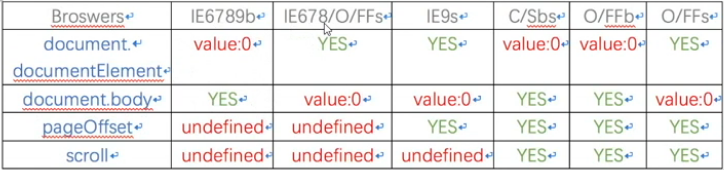

## 滚动距离

- 滚动距离：查看滚动条的距离

- 常规：

  - window.pageXOffset  / window.pageYOffset

  - IE9 / IE8 部分版本及以下

  ​       document.body.scrollLeft / document.body.scrollTop

  ​       document.documentElement.scrollLeft / scrollTop

- 不常见：window.scrollX / scrollY

- 图例



​       b: 怪异模式

​       a: 常规模式(standard)

- 浏览器左侧滚动条距离与实际滚动距离不是1:1，有一定比例关系。代码证明

  ```js
  // 复习时候写
  ```


### 滚动距离的兼容性写法

```js
function getScrollOffset () {
	if(window.pageXOffset){
		return {
			left: window.pageXOffset,
			top: window.pageYOffset
		};
	}else {
		return {
			left: document.body.scrollLeft + document.documentElement.scrollLeft,
			top: document.body.scrollTop + document.documentElement.scrollTop
		};
	}
}
```


## 浏览器的怪异模式和标准模式

> 现代浏览器产商一般会兼容5个版本

- 判断当前模式：`document.compatMode` 属性

  ​    compatMode`属性返回浏览器处理文档的模式，可能的值为`BackCompat`（向后兼容模式/怪异模式）和`CSS1Compat`（严格模式/标准模式）。

  一般来说，如果网页代码的第一行设置了明确的`DOCTYPE`（比如`<!doctype html>`），`document.compatMode`的值都为`CSS1Compat`。
  
- BackCompat: 

  - <font color="red">**document.body.clientHeight : 表示可视区域高度**</font>
  - <font color="red">**document.documentElement.clientHeight: 表示页面高度包含margin**</font>
  - <font color="red">**document.body.scrollTop: 表示页面滚动距离**</font>
  - <font color="red">**document.documentElement.scrollTop: 0 **</font>
  - <font color="red">**document.body.scrollHeight:  表示页面高度含margin**</font>
  - <font color="red">**document.documentElement.scrollHeight:  表示页面高度含margin**</font>

- CSS1Compat: 

  - <font color="red">**document.body.clientHeight : 表示页面高度不包含margin**</font>
  - <font color="red">**document.documentElement.clientHeight: 表示可视区域高度**</font>
  - <font color="red">**document.body.scrollTop: 0**</font>
  - <font color="red">**document.documentElement.scrollTop: 表示页面滚动距离 **</font>
  - <font color="red">**document.body.scrollHeight:  表示页面高度不含margin**</font>
  - <font color="red">**document.documentElement.scrollHeight:  表示页面高度含margin**</font>


## document.body 与 document.documentElement在不同模式下的区别

- 是否声明DTD决定了document.body 与 document.documentElement 在 scrollTop, scrollHeight, clientHeight 上的不同
- 实际上DTD的有无 也就是文档的document.compatMode是CSS1Compat 还是BackCompat
- 有无DTD document.body.offsetHeight === 所有内容高度不含margin
- 有无DTD document.documentElement.offsetHeight === 所有内容高度含margin

```
DTD已声明
IE
document.documentElement.scrollHeight  浏览器所有内容高度 ,document.body.scrollHeight  浏览器所有内容高度

document.documentElement.scrollTop  浏览器滚动部分高度，document.body.scrollTop 始终为0

document.documentElement.clientHeight  浏览器可视部分高度，document.body.clientHeight  浏览器所有内容高度


FF
document.documentElement.scrollHeight  浏览器所有内容高度 ,document.body.scrollHeight  浏览器所有内容高度

document.documentElement.scrollTop  浏览器滚动部分高度，document.body.scrollTop 始终为0

document.documentElement.clientHeight 浏览器可视部分高度，document.body.clientHeight  浏览器所有内容高度


Chrome
document.documentElement.scrollHeight  浏览器所有内容高度含margin， document.body.scrollHeight  浏览器所有内容高度不含margin

document.documentElement.scrollTop 始终为0，document.body.scrollTop  浏览器滚动部分高度

document.documentElement.clientHeight  浏览器可视部分高度，document.body.clientHeight  浏览器所有内容高度不含margin


DTD未声明
IE
document.documentElement.scrollHeight  浏览器可视部分高度，document.body.scrollHeight  浏览器所有内容高度

document.documentElement.scrollTop 始终为0，document.body.scrollTop  浏览器滚动部分高度

document.documentElement.clientHeight 始终为0，document.body.clientHeight  浏览器可视部分高度


FF
document.documentElement.scrollHeight  浏览器可视部分高度, document.body.scrollHeight 浏览器所有内容高度

document.documentElement.scrollTop 始终为0，document.body.scrollTop 浏览器滚动部分高度

document.documentElement.clientHeight 浏览器所有内容高度，document.body.clientHeight 浏览器可视部分高度


Chrome 
document.documentElement.scrollHeight 浏览器所有内容高度含margin度,document.body.scrollHeight 浏览器所有内容高度含margin

document.documentElement.scrollTop 始终为0，document.body.scrollTop 浏览器滚动部分高度

document.documentElement.clientHeight 浏览器所有内容高度，document.body.clientHeight 浏览器可视部分高度

浏览器所有内容高度即浏览器整个框架的高度，包括滚动条卷去部分+可视部分+底部隐藏部分的高度总和
```


## 浏览器的可视区域尺寸

- 常规：window.innerWidth /innerHeight
- IE9 / IE8 及以下
  - 标准模式：document.documentElement.clientWidth / clientHeight
  - 怪异模式：document.body.clientWidth / clientHeight
- innerWidth, innerHeight 和 document.body.clientWidht, document.boyd.clientHeight 的值是包含滚动条的， 但是document.documentElement.clientWidth 和 document.documentElement.clientHeight 是不包含滚动条的
- outerWidth 和 outerHeight 属性 返回浏览器窗口的高度和宽度，包括浏览器菜单和边框（单位像素）。这两个属性只读。

  

### 封装可视区域兼容性函数

```js
// 封装浏览器可视区域兼容性函数
function getViewportSize () {
    if (window.innerWidth) {
        return {
            width: window.innerWidth,
            height: window.innerHeight
        };
    }else {
        if(document.compatMode === 'BackCompat'){
            return {
                width: document.body.clientWidth,
                height: document.body.clientHeight
            };
        }else {
            return {
                width: document.documentElement.clientWidth,
                height: document.documentElement.clientHeight
            };
        }
    }
}
```


## document.body.scrollWidth(scrollHeight) 和 

`Element.scrollHeight`属性返回一个整数值（小数会四舍五入），表示当前元素的总高度（单位像素），包括溢出容器、当前不可见的部分。它包括`padding`，但是不包括`border`、`margin`以及水平滚动条的高度（如果有水平滚动条的话），还包括伪元素（`::before`或`::after`）的高度。

`Element.scrollWidth`属性表示当前元素的总宽度（单位像素），其他地方都与`scrollHeight`属性类似。这两个属性只读。

<font color=red>整张网页的总高度可以从`document.documentElement`或`document.body`上读取。</font>

```js
// 返回网页的总高度
document.documentElement.scrollHeight
document.body.scrollHeight
```

注意，如果元素节点的内容出现溢出，即使溢出的内容是隐藏的，`scrollHeight`属性仍然返回元素的总高度。

```js
// HTML 代码如下
// <div id="myDiv" style="height: 200px; overflow: hidden;">...<div>
document.getElementById('myDiv').scrollHeight // 356
```

上面代码中，即使`myDiv`元素的 CSS 高度只有200像素，且溢出部分不可见，但是`scrollHeight`仍然会返回该元素的原始高度。


### 兼容性写法

```js
function getScrollSize () {
    if(document.body.scrollWidth){
        return {
            width: document.body.scrollWidth,
            height: document.body.scrollHeight
        };
    } else {
        return {
            width: document.documentElement.scrollWidth,
            height: document.documentElement.scrollHeight
        };
    }
}
```


## getBoundingClientRect()

`Element.getBoundingClientRect`方法返回一个对象，提供当前元素节点的大小、位置等信息，基本上就是 CSS 盒状模型的所有信息。

```
var rect = obj.getBoundingClientRect();
```

上面代码中，`getBoundingClientRect`方法返回的`rect`对象，具有以下属性（全部为只读）。

- `x`：元素左上角相对于视口的横坐标
- `y`：元素左上角相对于视口的纵坐标
- `height`：元素高度
- `width`：元素宽度
- `left`：元素左上角相对于视口的横坐标，与`x`属性相等
- `right`：元素右边界相对于视口的横坐标（等于`x + width`）
- `top`：元素顶部相对于视口的纵坐标，与`y`属性相等
- `bottom`：元素底部相对于视口的纵坐标（等于`y + height`）

由于元素相对于视口（viewport）的位置，会随着页面滚动变化，因此表示位置的四个属性值，都不是固定不变的。如果想得到绝对位置，可以将`left`属性加上`window.scrollX`，`top`属性加上`window.scrollY`。

<font color=red>注意，`getBoundingClientRect`方法的所有属性，都把边框（`border`属性）算作元素的一部分。也就是说，都是从边框外缘的各个点来计算。因此，`width`和`height`包括了元素本身 + `padding` + `border`。</font>

另外，上面的这些属性，都是继承自原型的属性，`Object.keys`会返回一个空数组，这一点也需要注意。

```
var rect = document.body.getBoundingClientRect();
Object.keys(rect) // []
```

上面代码中，`rect`对象没有自身属性，而`Object.keys`方法只返回对象自身的属性，所以返回了一个空数组。


##  offsetLeft 和 offsetTop

- 值是相对于有定位的父级元素的左边距和上边距，如果父级元素没有定位就向上找有定位的父父级元素，如果都没有，就找body

- 举例说明

  ```js
  // 复习时举例
  ```

  

## offsetParent

- son.offsetParent属性 : 返回有定位的父级元素

- 如何直接找到当前元素相对于doc(body)的offset

  ```js
  function getElementDocumentPosition(el) {
      var parent = el.offsetParent,
          offsetLeft = el.offsetLeft,
          offsetTop = el.offsetTop;
      
      while(parent){
          offsetLeft += parent.offsetLeft;
          offsetTop += parent.offsetTop;
          parent = parent.offsetParent;
      }
      
      return {
          left: offsetLeft,
          top: offsetTop
      };
  }
  ```

  - 父级元素有边框怎么办？


## 操作滚动条

- window.scrollTo()，window.scroll()，window.scrollBy()

- `window.scrollTo`方法用于将文档滚动到指定位置。它接受两个参数，表示滚动后位于窗口左上角的页面坐标。

```
window.scrollTo(x-coord, y-coord)
```

它也可以接受一个配置对象作为参数。

```
window.scrollTo(options)
```

配置对象`options`有三个属性。

- `top`：滚动后页面左上角的垂直坐标，即 y 坐标。
- `left`：滚动后页面左上角的水平坐标，即 x 坐标。
- `behavior`：字符串，表示滚动的方式，有三个可能值（`smooth`、`instant`、`auto`），默认值为`auto`。

```
window.scrollTo({
  top: 1000,
  behavior: 'smooth'
});
```

- `window.scroll()`方法是`window.scrollTo()`方法的别名。

- `window.scrollBy()`方法用于将网页滚动指定距离（单位像素）。它接受两个参数：水平向右滚动的像素，垂直向下滚动的像素。

```
window.scrollBy(0, window.innerHeight)
```

上面代码用于将网页向下滚动一屏。

如果不是要滚动整个文档，而是要滚动某个元素，可以使用下面三个属性和方法。

- Element.scrollTop
- Element.scrollLeft
- Element.scrollIntoView()


## 练习

- 写一个小说列表页面，该页面要出现滚动条，页面下端有个按钮，能回到顶部
- 点击任意一个列表元素跳转到小说详情页，底部有个自动滚动按钮，点击后页面能够自动滚动


