## HTTP报文前言

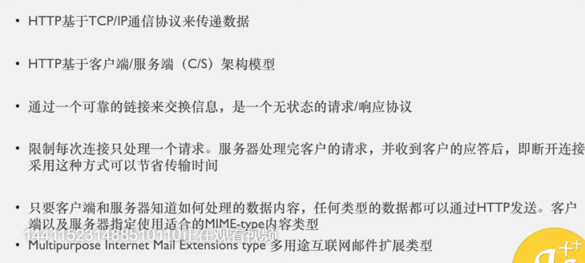

- 报文： 客户端和服务端之间的信息传递
- 无状态的请求/响应协议： 断开后都是重新连接，没有之前连接的记忆
- 限制每次连接只处理一个请求： 只是传统的TCP/IP处理方式

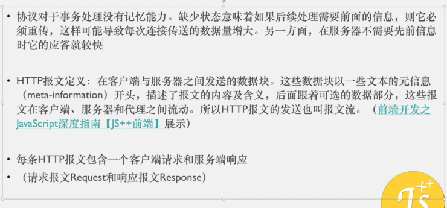

---

## HTTP报文

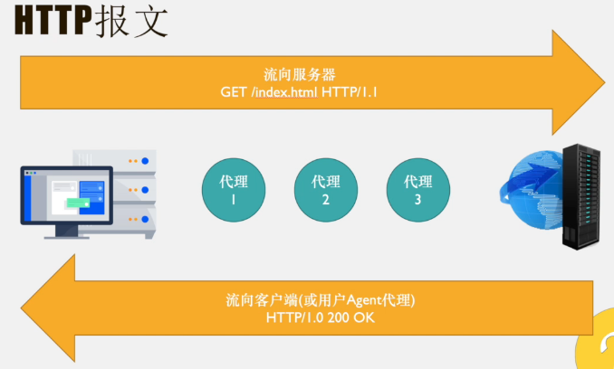

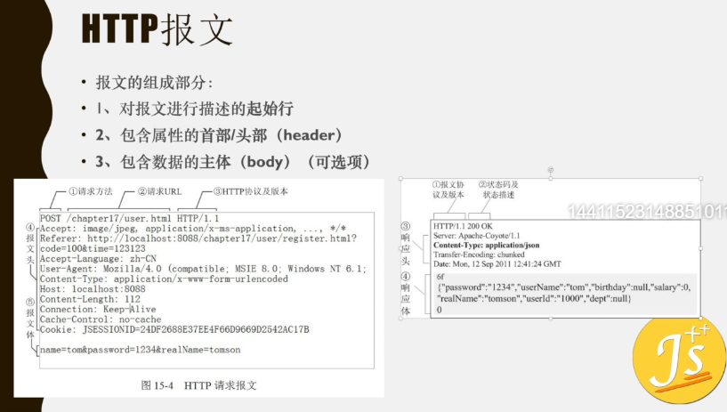

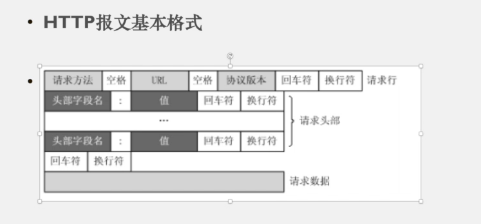

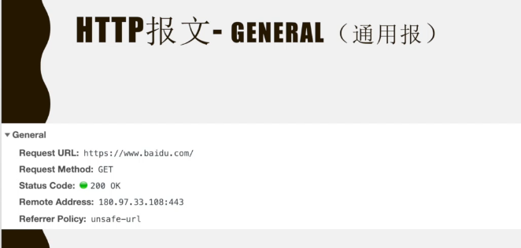

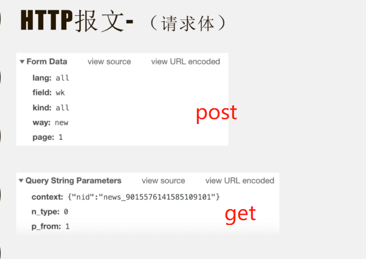

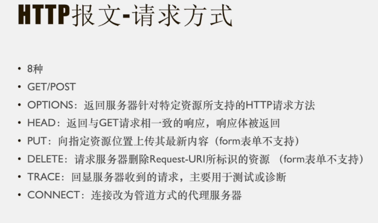

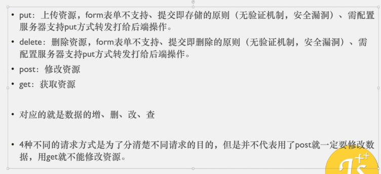

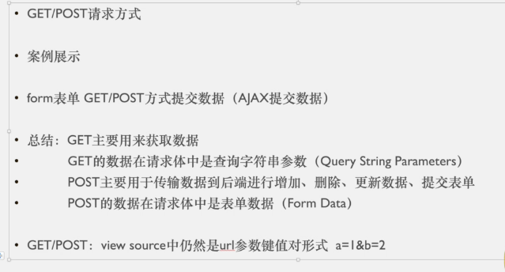

- 实际在传输数据时： GET/POST 都是用 a=1&b=2 这种形式传数据的，只是get在url中提现

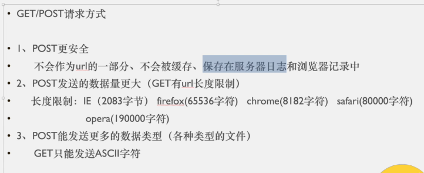

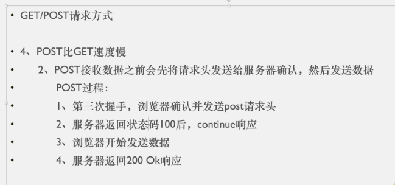

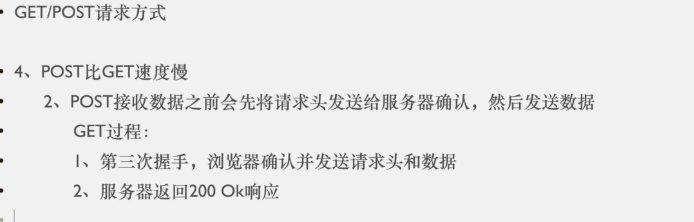

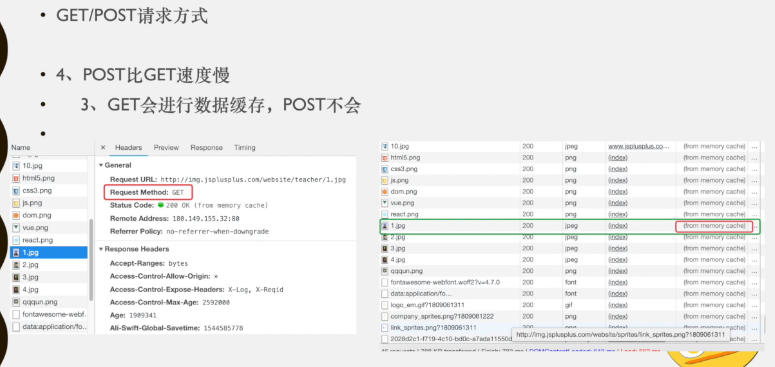

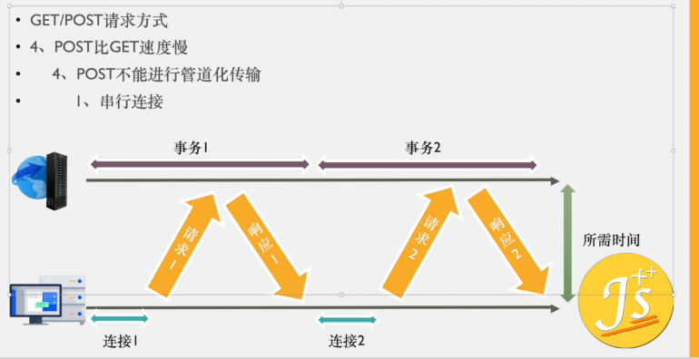

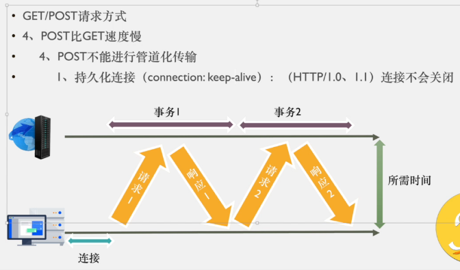

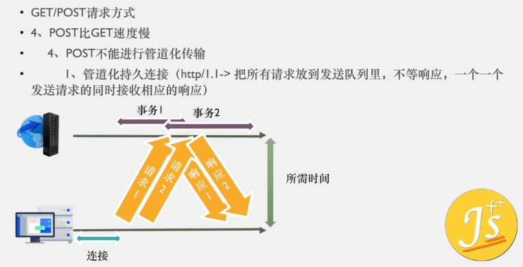

- 管道化持久连接的弊端： 一旦TCP/IP连接中断，只能重新提交队列，这时如果存在支付业务，就要在支付一次

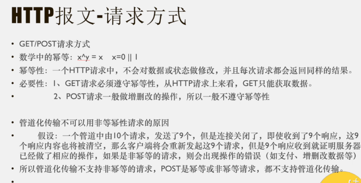

- 幂等性重点：每次请求都返回相同的结果
- POST请求不具有幂等性，所以不能使用管道化传输
- 管道化持久连接不支持POST方式
- 现在浏览器大多数使用Keep-alive方式，要使用管道化连接需要单独配置

---

## HTTP报文状态码

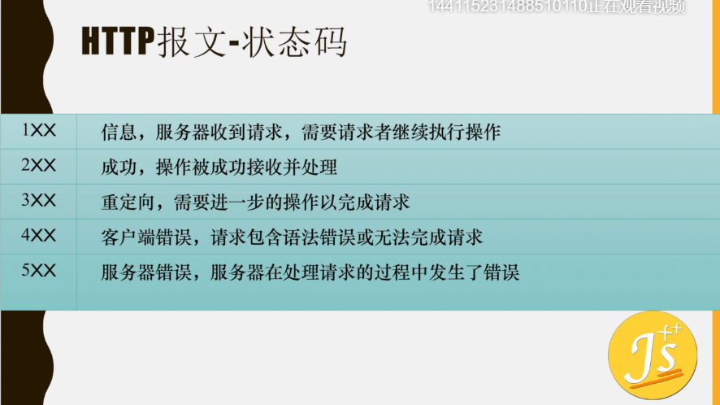

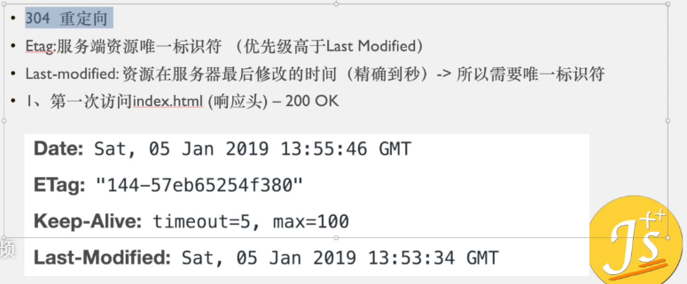

- 客服端 
  - if-Modified-Since: Sat, 05 Jan 2019 13:53:34 GMT
  - if-None-Match: "144-573b65254f380"
  - 存储了第一次访问index.html 时的服务端返回头的ETag和Last-Modifiled 的值
  - 当再次请求时，请求头携带这个两个属性给到服务端，服务端用ETag 和 Last-Modifiled 的值和客服端传来的这两个值进行比对，如果都相同，则告诉客服端从缓存获取index.html 这个文件，这时传来的状态吗就是304
  - Last-Modifiled: 使用的是GMT 也叫 世界协调时，中国是东八区 （东加西减），所以中国的时间是在GMT时间上加8

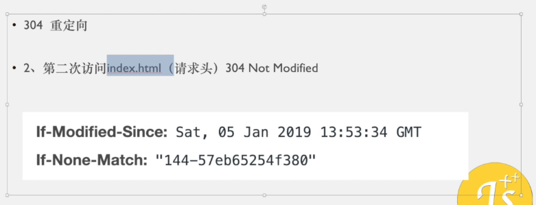

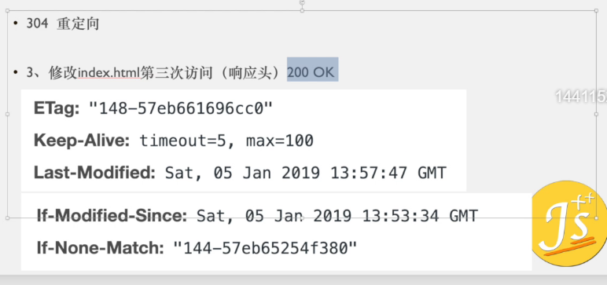

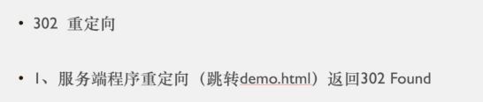

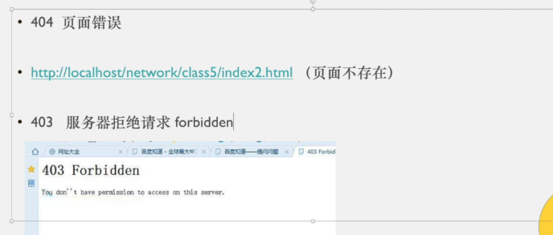

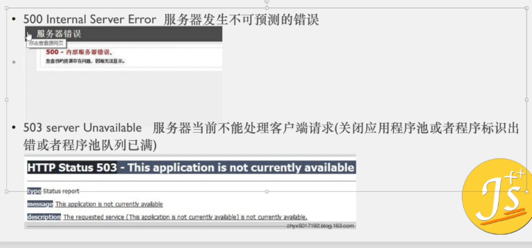

- 503 可能只是临时错误，比如服务端程序池已满，可能下一秒就可以访问了

###  一、临时响应

**1xx**：**表示临时响应并需要请求者继续执行操作的状态码。**

- 100(继续)请求者应当继续提出请求。服务器返回此代码表示已收到请求的第一部分，正在等待其余部分。

- 101(切换协议)请求者已要求服务器切换协议，服务器已确认并准备切换。只有在切换新的协议更有好处的时候才应该采取类似措施。

- 102 Processing由WebDAV（RFC 2518）扩展的状态码，代表处理将被继续执行。

###  二、成功

**2xx****：表示成功处理了请求的状态码。**

- 200(成功)服务器已成功处理了请求。通常，这表示服务器提供了请求的网页。如果是对您的robots.txt 文件显示此状态码，则表示 Googlebot 已成功检索到该文件。

- 201(已创建)请求成功并且服务器创建了新的资源。

- 202(已接受)服务器已接受请求，但尚未处理。

- 203(非授权信息)服务器已成功处理了请求，但返回的信息可能来自另一来源。

- 204(无内容)服务器成功处理了请求，但没有返回任何内容。

- 205(重置内容)服务器成功处理了请求，但没有返回任何内容。与 204 响应不同，此响应要求请求者重置文档视图(例如，清除表单内容以输入新内容)。

- 206(部分内容)服务器成功处理了部分 GET 请求。

 

### 三、重定向

**3xx**：**要完成请求，需要进一步操作。通常，这些状态码用来重定向。****Google** **建议您在每次请求中使用重定向不要超过****5** **次。您可以使用网站管理员工具查看一下****Googlebot** **在抓取重定向网页时是否遇到问题。诊断下的网络抓取页列出了由于重定向错误导致** **Googlebot** **无法抓取的网址。**

- 300(多种选择)针对请求，服务器可执行多种操作。服务器可根据请求者 (user agent) 选择一项操作，或提供操作列表供请求者选择。

- 301(永久移动)请求的网页已永久移动到新位置。服务器返回此响应(对 GET 或 HEAD 请求的响应)时，会自动将请求者转到新位置。您应使用此代码告诉某个网页或网站已永久移动到新位置。

- 302(临时移动)服务器目前从不同位置的网页响应请求，但请求者应继续使用原有位置来响应以后的请求。此代码与响应 GET 和 HEAD 请求的 301 代码类似，会自动将请求者转到不同的位置，但您不应使用此代码来告诉某个网页或网站已经移动，因为 Googlebot 会继续抓取原有位置并编制索引。

- 303(查看其他位置)请求者应当对不同的位置使用单独的 GET 请求来检索响应时，服务器返回此代码。对于除 HEAD 之外的所有请求，服务器会自动转到其他位置。

- 304(未修改)自从上次请求后，请求的网页未修改过。服务器返回此响应时，不会返回网页内容。

如果网页自请求者上次请求后再也没有更改过，您应将服务器配置为返回此响应(称为 If-Modified-Since HTTP 标头)。服务器可以告诉 Googlebot 自从上次抓取后网页没有变更，进而节省带宽和开销。

- 305(使用代理)请求者只能使用代理访问请求的网页。如果服务器返回此响应，还表示请求者应使用代理。

- 307(临时重定向)服务器目前从不同位置的网页响应请求，但请求者应继续使用原有位置来响应以后的请求。此代码与响应 GET 和 HEAD 请求的 301 代码类似，会自动将请求者转到不同的位置，但您不应使用此代码来告诉 Googlebot 某个页面或网站已经移动，因为 Googlebot 会继续抓取原有位置并编制索引。

 

### 四、请求错误

**4xx**：**这些状态码表示请求可能出错，妨碍了服务器的处理。**

- 400(错误请求)服务器不理解请求的语法。

- 401(未授权)请求要求身份验证。对于登录后请求的网页，服务器可能返回此响应。

- 403(禁止)服务器拒绝请求。如果您在 Googlebot 尝试抓取您网站上的有效网页时看到此状态码(您可以在 Google 网站管理员工具诊断下的网络抓取页面上看到此信息)，可能是您的服务器或主机拒绝了 Googlebot 访问。

- 404(未找到)服务器找不到请求的网页。例如，对于服务器上不存在的网页经常会返回此代码。

如果您的网站上没有 robots.txt 文件，而您在 Google 网站管理员工具"诊断"标签的 robots.txt 页上看到此状态码，则这是正确的状态码。但是，如果您有 robots.txt 文件而又看到此状态码，则说明您的 robots.txt 文件可能命名错误或位于错误的位置(该文件应当位于顶级域，名为 robots.txt)。如果对于 Googlebot 抓取的网址看到此状态码(在"诊断"标签的 HTTP 错误页面上)，则表示 Googlebot 跟随的可能是另一个页面的无效链接(是旧链接或输入有误的链接)。

- 405(方法禁用)禁用请求中指定的方法。

- 406(不接受)无法使用请求的内容特性响应请求的网页。

- 407(需要代理授权)此状态码与 401(未授权)类似，但指定请求者应当授权使用代理。如果服务器返回此响应，还表示请求者应当使用代理。

- 408(请求超时)服务器等候请求时发生超时。

- 409(冲突)服务器在完成请求时发生冲突。服务器必须在响应中包含有关冲突的信息。服务器在响应与前一个请求相冲突的 PUT 请求时可能会返回此代码，以及两个请求的差异列表。

- 410(已删除)如果请求的资源已永久删除，服务器就会返回此响应。该代码与 404(未找到)代码类似，但在资源以前存在而现在不存在的情况下，有时会用来替代404代码。如果资源已永久移动，您应使用301 指定资源的新位置。

- 411(需要有效长度)服务器不接受不含有效内容长度标头字段的请求。

- 412(未满足前提条件)服务器未满足请求者在请求中设置的其中一个前提条件。

- 413(请求实体过大)服务器无法处理请求，因为请求实体过大，超出服务器的处理能力。

- 414(请求的 URI 过长)请求的 URI(通常为网址)过长，服务器无法处理。

- 415(不支持的媒体类型)请求的格式不受请求页面的支持。

- 416(请求范围不符合要求)如果页面无法提供请求的范围，则服务器会返回此状态码。

- 417(未满足期望值)服务器未满足"期望"请求标头字段的要求。

 

### 五、服务器错误

**5xx**：**这些状态码表示服务器在处理请求时发生内部错误。这些错误可能是服务器本身的错误，而不是请求出错。**

- 500(服务器内部错误)服务器遇到错误，无法完成请求。

- 501(尚未实施)服务器不具备完成请求的功能。例如，服务器无法识别请求方法时可能会返回此代码。

- 502(错误网关)服务器作为网关或代理，从上游服务器收到无效响应。

- 503(服务不可用)服务器目前无法使用(由于超载或停机维护)。通常，这只是暂时状态。

- 504(网关超时)服务器作为网关或代理，但是没有及时从上游服务器收到请求。

- 505(HTTP 版本不受支持)服务器不支持请求中所用的 HTTP 协议版本。

 

---

## HTTP 报文- ACCEPT & Content-Type

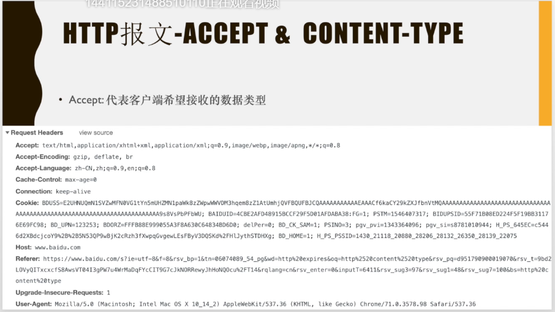

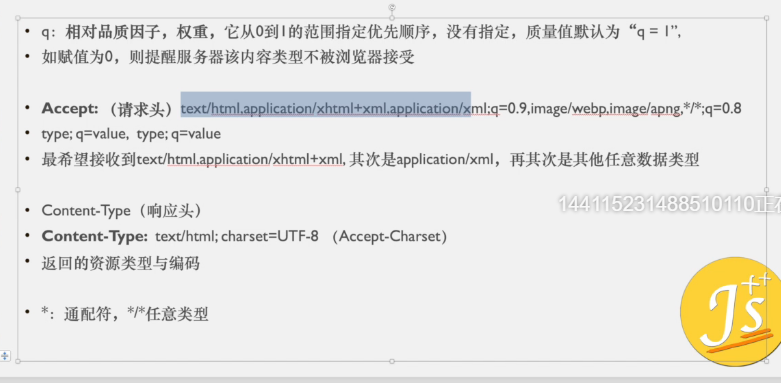

- Accept 请求头中，是 , 号分割

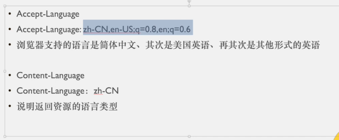

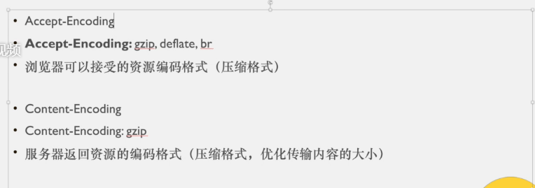

- 压缩格式： 优化传输内容的大小