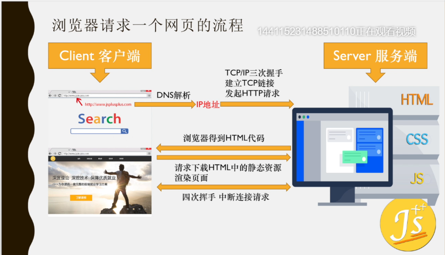

## 减少http请求的方法

从URL回车 -> 页面呈现有哪些步骤

1. URL 输入 回车

2. DNS 解析 -> 解析URL -> 编程响应的服务器的IP地址，或者代理服务器的IP地址

3. 浏览器网络向服务器发起TCP/IP请求，三次握手

4. 建立TCP/IP 连接

5. 浏览器网络发起HTTP请求

6. 等待响应过程waiting

7. 下载HTML代码

8. 解析HTML

9. 遇到HTML中的资源，再次发起HTTP请求，下载资源

   完毕后通过4次挥手断开连接

10. 渲染页面

11. 呈现页面

### 从URL回车 -> 页面呈现的步骤中哪个部分最耗费资源

**HTTP请求部分最耗费资源和事件**

### 如何减少HTTP请求

1. 能做雪碧图就做雪碧图，CSS雪碧图 -> 大多数适合装饰和图标作用，经常更新的图片就不适合雪碧图
2. base64编码图片，坏处是增加了数据量，图片太大，解析耗时
3. 合并脚本与样式表代码: HTML/JS/CSS -> 开发版和线上版 分开 -> 工程化 -> webpack gulp grunt
4. 配置多个域名，CDN加速：CDN具备并发请求 （你用你的域名 在第三方服务器上进行解析，从而生成CDN加速域名，比如 七牛云
5. 尽量使用浏览器的缓存机制
6. img map : 可以制作图片地图，但是兼容性有问题（用的不多）

