## 网络初探

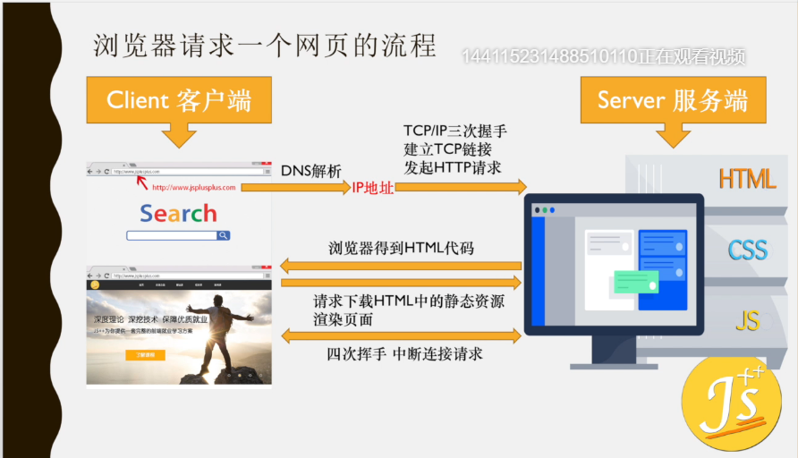

- 为什么使用网址而不直接使用IP地址
  - 不方便记忆
  - 一个IP地址可以映射多个域名
- 重点 三次握手
  - client 和 server 建立链接要经过三次握手，才能完成， 才可以发起HTTP请求
- 发起请求后， client先获得HTML代码，在根据HTML代码的内容请求下载静态资源
- client 渲染页面后，在4次挥手，中断与server的链接请求
- TCP/IP 是一个长连接

---

## URL

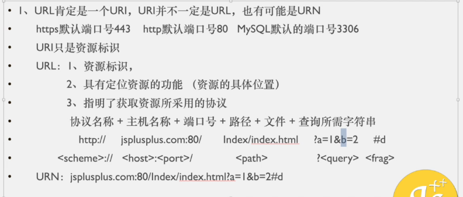

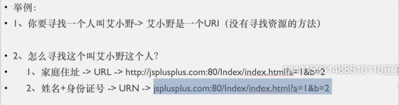

---

## 客户端与服务端

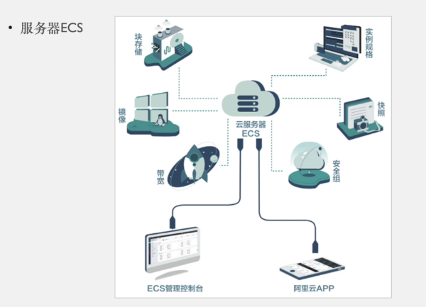

---

## 域名

- 使用第三方云存储来存储静态文件：图片，视频等

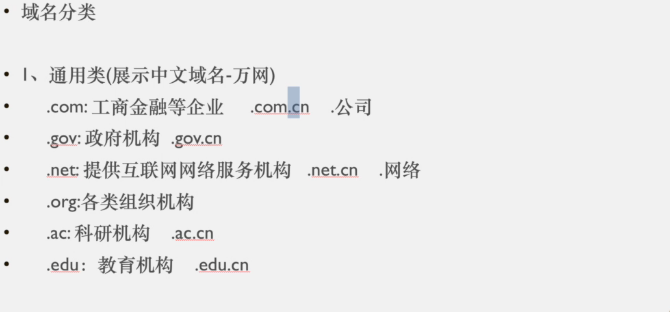

---

## DNS

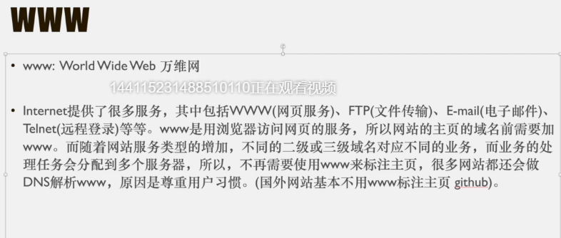

- www: 是协议 -> 网页服务协议 -> 不是二级域名
- 原来所有的主页的域名前都要加www, 如果要访问其他服务只能 www.baidu.com/baike 或者 www.baidu.com/pan , 这种写法啊，相当于在同一个服务器中多建立两个目录。
- 但是随着服务类型的增加和数量的加大，不同的服务类型会放到不同的服务器上，所以就增加了二级或者三级域名，也就很不使用www了

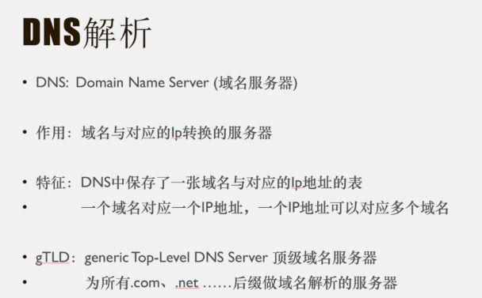

1. 先反问根服务器，返回的结果在本地DNS服务器缓存

2. 再访问.com域服务器，返回的结果在本地DNS服务器缓存

3. 在到jsplusplus.com域服务器，返回结果在本地DNS服务器缓存

4. 解析从右到左，在本地没有缓存情况下，从 . 开始，. 就是根服务器，然后是.com 或者.net

   ,然后才到 jsplusjsplus.com, 然后才到二级域名

---

## IP

---

## TCP

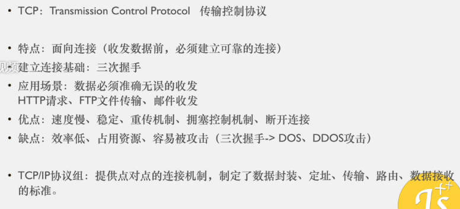

- 有服务就必须有协议

---

## UDP

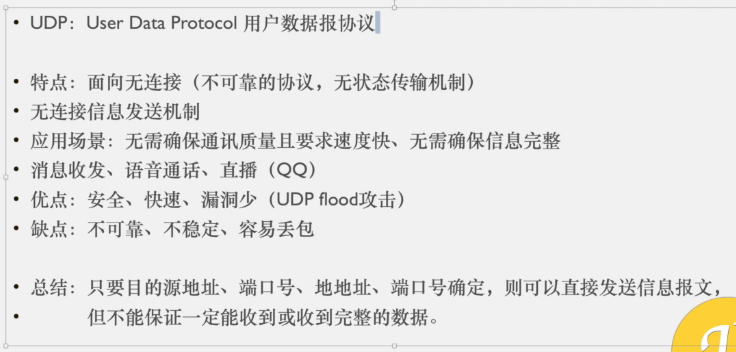

---

## HTTP 、HTTPS

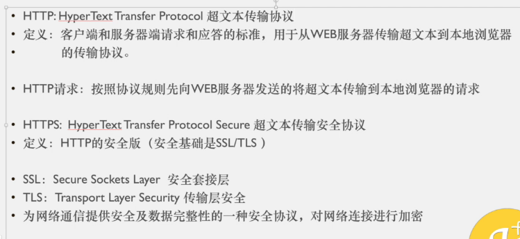

- HTML： 超文本标记语言(英语:HyperText Markup Language,简称:*HTML*)

---

## 建立TCP连接的三次握手

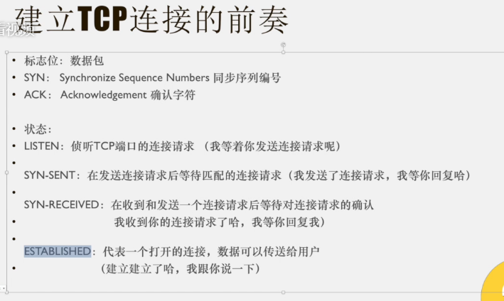

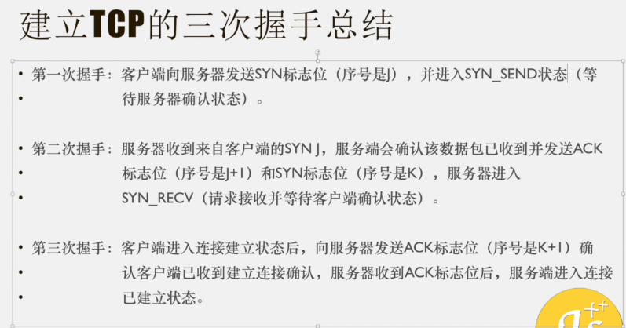

