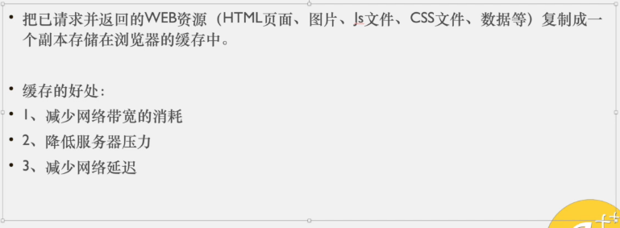
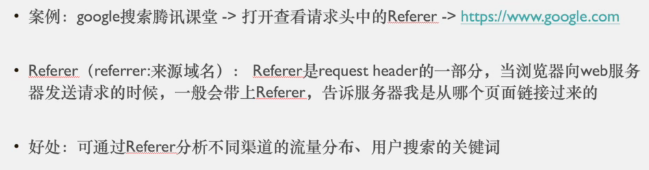
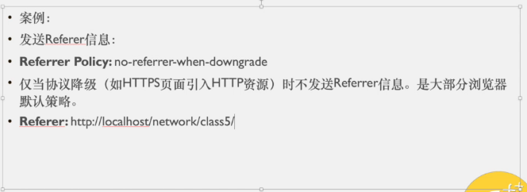

## 浏览器缓存

- 如果 Cache-Control 和 Pragma 同时存在，Cache-Control 优先级高于Pragma

- no-cache: 不是说不缓存，是指忽略缓存副本，强制到服务器获取资源
- no-store: 才是不保留缓存

---

## 长短连接

---

## CONTENT -LENGTH

- length 单位是字符， length长度是按底层传递的格式来计算的也就是按 a=1&b=2 这种格式来计算的

---

## REFERER

- 第三张图是在meta 中不设定referrer
- no-referrer-when-downgrade: 仅当协议降级 -> HTTPS 跳转 HTTP 时不发送Referrer信息

- 简述 referrer 的防盗链机制
- 简述 七牛的时间戳防盗链机制 ： 通过时间和签名生成一个秘钥，这个秘钥写在链接后面。当发起请求时，服务器识别秘钥，获得时间和签名，比对时间和签名，判断是否正确响应请求

