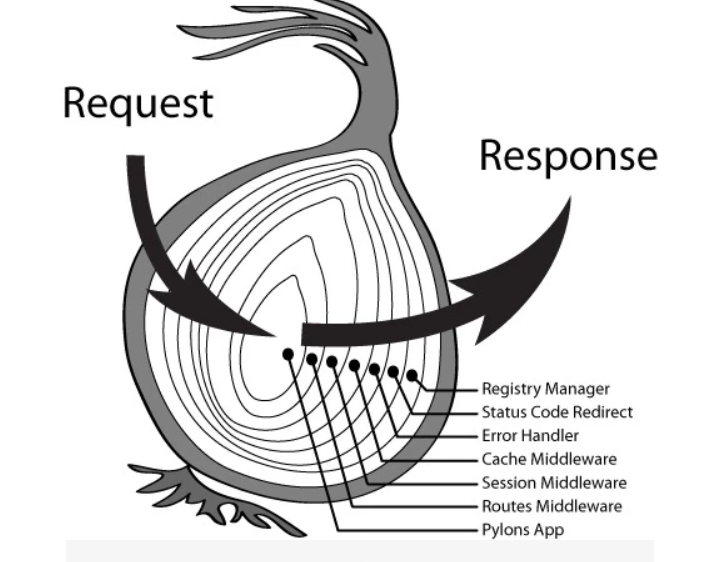
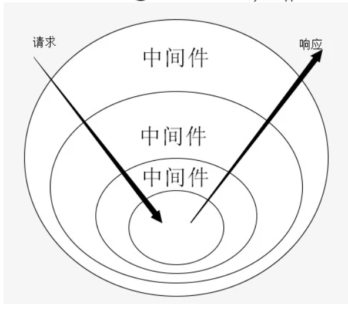

##  koa2 入门

1. npm init -y

2. npm install koa --save

3. 入口文件 -> app.js

4. npm install nodemon

5. const Koa = require('koa')

6. const app = new Koa();

7. koa 中间件 -》 函数
   在浏览器发送 HTTP 请求到 Koa 程序的时候，我们才执行中间件
   如何让函数成为中间件 -》 app.use(fn); -> 注册中间件

8. app.use((ctx, next)=>{})

   - ctx: 上下文
   - next: 代指下一个函数

9. 洋葱模型

   > 一个中间件只能调用一次 next();

   - 中间件函数执行的结果都是 Promise 对象

   



```js
// 打印的是什么
// 1342
app.use((ctx, next) => {
  console.log(1);
  next();
  console.log(2);
});
app.use((ctx, next) => {
  console.log(3);
  next();
  console.log(4);

```

10. async...await

- 有求值功能
- await 后面能跟 Promise 或者 表达式
- await 有阻塞线程的功能 (让代码一行一行执行，await 后面的语句必须等待 await 执行完成后才能执行)
- promise 如何实现阻塞线程，将 promise.then 后面的代码放入到一个.then 里面，让其等待 promise.then 执行完成后在执行

```js
// 使用promise.then -》 1342 jayden
app.use((ctx, next) => {
  console.log(1);
  const resultPromise = next();
  resultPromise.then((result) => {
    console.log(result);
  });
  console.log(2);
});
app.use((ctx, next) => {
  console.log(3);
  next();
  console.log(4);

  return "jayden";
});
```

```js
// 使用 async...await -> 134 jayden 2
app.use(async (ctx, next) => {
  console.log(1);
  const result = await next();
  cosole.log(result);
  console.log(2);
});
app.use((ctx, next) => {
  console.log(3);
  next();
  console.log(4);

  return "jayden";
});
```

11. async
    如果一个函数前面使用了 async 关键字，那么这个函数的返回值是一个 promise

12. koa2 的中间件的返回值就是一个 promise，加不加 async 都一样

13. 如何保证洋葱模型

```js
// 第二个 函数async破坏了 洋葱模型： 结果为1324, 希望结果是1342
app.use((ctx, next) => {
  console.log(1);
  next();
  console.log(2);
});
app.use(async (ctx, next) => {
  console.log(3);
  const axios = require('axios);
  const result = await axios.get('http://www.baidu.com);
  next();
  console.log(4);

```

```js
// 保持洋葱模型的办法，在第一个中间件加上async...await
app.use(async (ctx, next) => {
  console.log(1);
  await next();
  console.log(2);
});
app.use(async (ctx, next) => {
  console.log(3);
  const axios = require('axios);
  const result = await axios.get('http://www.baidu.com);
  next();
  console.log(4);
```

14. 为什么要保证洋葱模型：

- 计时要求

## koa 异常处理

- 常用的异常处理方式

1. return false
   if(err){ return false}

2. throw Error -> try...catch()...

3. return false 不能确认错误的具体信息, 所以最好使用 throw 抛出异常

4. 如果对每个函数都进行 try..catch..就太多，如何减少 try...catch, 有两个办法

- 1. 如果有把握自己写的函数不会出错，就只需要在调用第三方程序是在使用 try..catch
- 2. 全局异常处理

### 为什么要做异常处理

- 为了能够更加好的告诉函数的使用方，这个异常是什么异常

- 没有做异常处理：Internal Server Error

- 做了异常处理：{ errorno: 10001, msg: '权限不足'}

### try ... catch().. 只对同步代码有效，异步代码无效的解决

1.  使用 async await + try...catch()... 来解决

2.  使用 Promise 来解决

3.  使用回调函数来解决

### 全局异常处理
