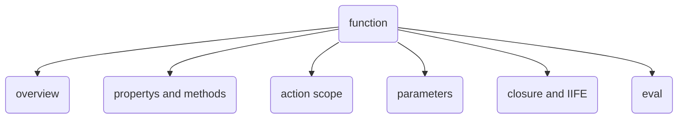
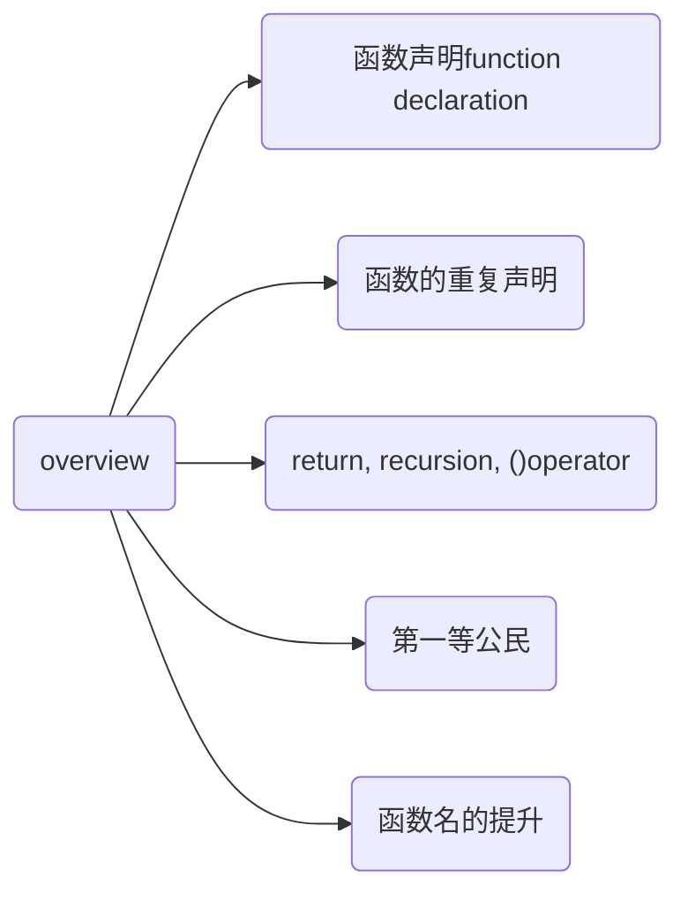
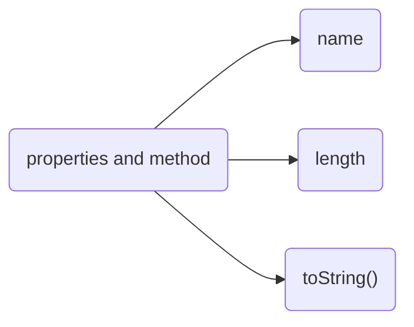
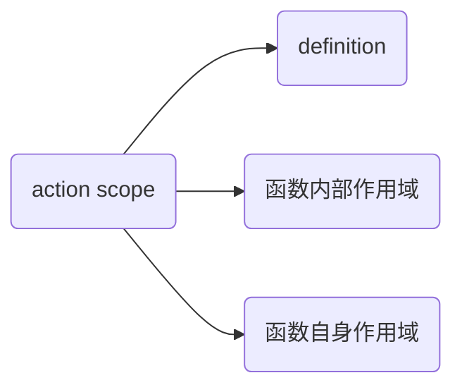

# Function Recitation

## Function Mind Map

```mermaid
graph TB
A(function) --> B(overview)
A --> C(propertys and methods)
A --> D(action scope)
A --> E(parameters)
A --> F(closure and IIFE)
A --> G(eval)
```

```mermaid
graph LR
a(overview) --> b(函数声明function declaration)
a --> c(函数的重复声明)
a --> d("return, recursion, ()operator")
a --> e("第一等公民")
a --> f("函数名的提升")
```

```mermaid
graph LR
a(properties and method) --> b(name)
a --> c(length)
a --> d("toString()")
```

```mermaid
graph LR
a(action scope) --> b(definition)
a --> c(函数内部作用域)
a --> d(函数自身作用域)
```